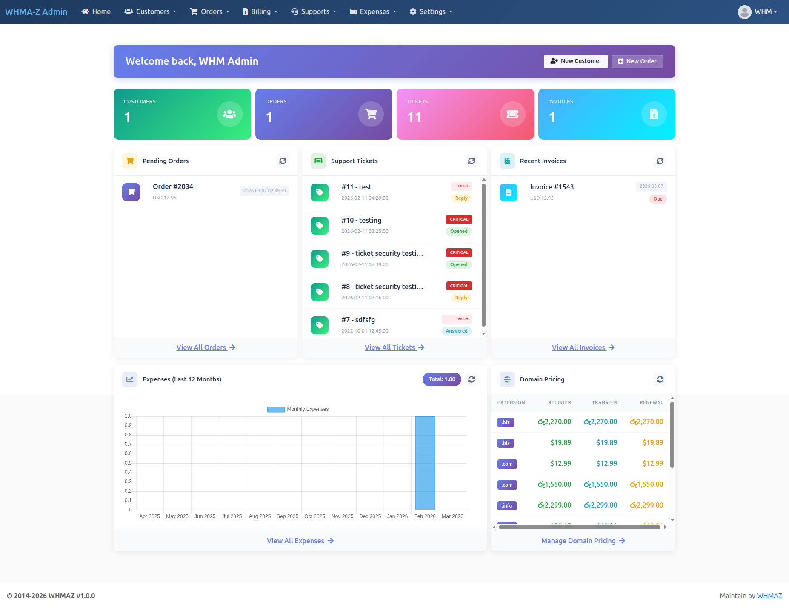

# 🚀 WHMAZ - Complete Hosting & Service Provider CRM

> **The Ultimate WHMCS Alternative** - A comprehensive web hosting automation platform and client management system built with CodeIgniter 3.x

[](CHANGELOG.md)
[](https://php.net)
[](https://codeigniter.com)
[](LICENSE.txt)
[]()

---

## 📖 Table of Contents

- [Overview](#-overview)
- [Key Features](#-key-features)
- [Screenshots](#-screenshots)
- [Live Demo](#-live-demo)
- [Server Requirements](#-server-requirements)
- [Installation](#-installation)
- [Configuration](#-configuration)
- [Features Breakdown](#-features-breakdown)
- [Technology Stack](#-technology-stack)
- [Browser Compatibility](#-browser-compatibility)
- [Documentation](#-documentation)
- [Support](#-support)
- [Changelog](#-changelog)
- [License](#-license)
- [Credits](#-credits)

---

## 🎯 Overview

**WHMAZ** is a powerful, feature-rich CRM system specifically designed for web hosting companies and service providers. It provides everything you need to automate your business operations, manage customers, process orders, handle billing, and deliver exceptional support - all from a single, unified platform.

Built on the robust CodeIgniter 3.x framework with HMVC architecture, WHMAZ offers a modern, responsive interface and enterprise-grade security features that make it the perfect alternative to expensive solutions like WHMCS.

### 🌟 Why Choose WHMAZ?

- ✅ **Complete Business Automation** - From order placement to invoice generation
- ✅ **Dual Portal System** - Separate client and admin interfaces
- ✅ **Modern & Responsive** - Built with Bootstrap 5, works on all devices
- ✅ **Beautiful Client Portal** - Professional UI with modern gradients and animations
- ✅ **Secure by Design** - CSRF protection, XSS prevention, SQL injection prevention
- ✅ **Domain Management** - ResellerClub/Resell.biz/Namecheap integration
- ✅ **Extensible Architecture** - HMVC modular design for easy customization
- ✅ **Production Ready** - Battle-tested code, ready to deploy
- ✅ **Well Documented** - Comprehensive guides for users and developers
- ✅ **CodeCanyon Compliant** - All CSS externalized, no inline styles

---

## ✨ Key Features

### 🛒 **Order Management**
- Complete order lifecycle management (Pending → Active → Expired)
- Product/Service catalog with customizable pricing
- Shopping cart with multiple billing cycles
- Domain registration, transfer, and renewal
- **Auto-provisioning after payment:**
  - Domain registration/transfer/renewal via registrar API
  - Hosting account creation via cPanel/WHM API
  - Automatic unsuspend on renewal payment
- Automated order processing

### 💳 **Billing & Invoicing**
- Automated invoice generation
- Multiple currency support
- Flexible payment terms
- Payment gateway integration ready
- Tax and VAT calculation
- Payment tracking and reconciliation
- PDF invoice generation
- **Order confirmation emails** (customer & admin notification)
- **Payment confirmation emails** (automatic on successful payment)

### 👥 **Customer Management (CRM)**
- Company/Client profiles
- Contact management
- Service assignment
- Order history tracking
- Invoice history
- Support ticket history
- Customer portal access

### 🎫 **Support System**
- Multi-department ticket management
- Priority levels (Low, Medium, High, Critical)
- Ticket status tracking
- **Automatic email notifications:**
  - New ticket → Department email notification
  - Admin creates ticket → Customer notification
  - Ticket replies → Both customer and department notified
- File attachments
- Internal notes
- Customer satisfaction ratings

### 📚 **Knowledge Base**
- Article management with categories
- Rich text editor (Quill)
- Search functionality
- View tracking
- Upvote/Downvote system
- Tag support
- Public/Private articles

### 🌐 **Domain Management**
- Domain availability check
- Domain suggestions
- ResellerClub/Resell.biz API integration
- Multiple TLD support
- Domain pricing management
- Registration periods
- Transfer and renewal pricing

### 📢 **Announcements**
- System-wide announcements
- Publish scheduling
- Category management
- View tracking
- Rich content support

### 💰 **Expense Tracking**
- Expense categorization
- Vendor management
- Date-based reporting
- Expense analytics
- Receipt attachments

### 📊 **Dashboard & Reports**
- Admin dashboard with key metrics
- Customer dashboard
- Revenue tracking
- Order statistics
- Support ticket metrics
- Recent activity feeds

### 🔧 **System Configuration**
- Currency management
- Billing cycle configuration
- Service categories and groups
- Server management
- Product/Service modules
- **Service product management with cPanel/WHM integration**
- **Real-time cPanel usage sync** (disk, bandwidth, emails, databases, addon domains)
- Domain extension pricing
- **Email template management** (database-driven with Quill editor, categories, placeholders)
- **Dunning rules management** (automated overdue payment collection workflow)
- System settings

### 🔐 **Security Features**
- CSRF (Cross-Site Request Forgery) protection
- XSS (Cross-Site Scripting) prevention
- SQL injection prevention with parameterized queries
- Password hashing with `password_hash()`
- Session security with database storage
- Input validation and sanitization
- Error logging and monitoring
- Admin activity tracking

---

## 📸 Screenshots

### Client Portal

*Customer dashboard with service overview, invoices, and support tickets*


*Easy service ordering with shopping cart*


*Submit and track support tickets*

### Admin Portal

*Comprehensive admin dashboard with analytics*


*Manage all customer orders in one place*


*Invoice generation and payment tracking*

> **Note:** Create a `screenshots/` folder and add your actual screenshots

---

## 🎮 Live Demo

### Client Portal Demo
**URL:** `http://your-demo-site.com/`

**Demo Customer Credentials:**
- **Email:** customer@demo.com
- **Password:** Demo@123

### Admin Portal Demo
**URL:** `http://your-demo-site.com/whmazadmin/authenticate/login`

**Demo Admin Credentials:**
- **Username:** admin@demo.com
- **Password:** Admin@123

> ⚠️ **Note:** Demo site is reset every 24 hours. Please don't change the demo credentials.

---

## 💻 Server Requirements

### Minimum Requirements

| Requirement | Minimum | Recommended |
|------------|---------|-------------|
| **PHP** | 8.2.0 | 8.3+ |
| **MySQL** | 5.7 | 8.0+ |
| **MariaDB** | 10.3 | 10.6+ |
| **Apache** | 2.4 | 2.4+ |
| **Disk Space** | 500 MB | 1 GB+ |
| **RAM** | 512 MB | 2 GB+ |

### Required PHP Extensions

```
✓ php-curl
✓ php-gd
✓ php-mbstring
✓ php-xml
✓ php-zip
✓ php-json
✓ php-mysqli
✓ php-openssl
✓ php-fileinfo
```

### Apache Modules

```
✓ mod_rewrite (for clean URLs)
✓ mod_headers
```

### Additional Requirements

- **SSL Certificate** (recommended for production)
- **Cron job** access (for automated tasks)
- **Email server** (SMTP recommended)

---

## 🚀 Installation

### Quick Start (5 Minutes)

Follow these simple steps to get WHMAZ up and running:

#### Step 1: Download & Extract

```bash
# Extract the downloaded ZIP file to your web root
unzip whmaz-crm.zip -d /var/www/html/whmaz
cd /var/www/html/whmaz
```

#### Step 2: Create Database

```bash
# Login to MySQL
mysql -u root -p

# Create database
CREATE DATABASE whmaz_crm CHARACTER SET utf8mb4 COLLATE utf8mb4_unicode_ci;

# Create user (optional but recommended)
CREATE USER 'whmaz_user'@'localhost' IDENTIFIED BY 'your_secure_password';
GRANT ALL PRIVILEGES ON whmaz_crm.* TO 'whmaz_user'@'localhost';
FLUSH PRIVILEGES;
EXIT;
```

#### Step 3: Import Database

```bash
# Import main database
mysql -u root -p whmaz_crm < crm_db.sql

# Import database views
mysql -u root -p whmaz_crm < crm_db_views.sql
```

#### Step 4: Configure Database Connection

Edit `src/config/database.php`:

```php
$db['default'] = array(
    'hostname' => 'localhost',
    'username' => 'whmaz_user',      // Your database username
    'password' => 'your_password',    // Your database password
    'database' => 'whmaz_crm',        // Your database name
    'dbdriver' => 'mysqli',
    // ... other settings
);
```

#### Step 5: Configure Base URL

Edit `src/config/config.php`:

```php
$config['base_url'] = 'http://yourdomain.com/'; // Your domain URL
```

#### Step 6: Set Folder Permissions

```bash
# Make writable folders
chmod -R 755 src/sessions/
chmod -R 755 src/logs/
chmod -R 755 src/cache/
chmod -R 755 resources/uploads/
```

#### Step 7: Configure Apache (if needed)

Create/edit `.htaccess` in root folder:

```apache
RewriteEngine On
RewriteCond %{REQUEST_FILENAME} !-f
RewriteCond %{REQUEST_FILENAME} !-d
RewriteRule ^(.*)$ index.php/$1 [L]
```

#### Step 8: Access Your Installation

**Client Portal:** `http://yourdomain.com/`
**Admin Portal:** `http://yourdomain.com/whmazadmin/authenticate/login`

**Default Admin Credentials:**
- Username: `admin@demo.com`
- Password: `Admin@123`

> ⚠️ **IMPORTANT:** Change default admin password immediately after first login!

---

### Detailed Installation Guide

For detailed installation instructions with screenshots and troubleshooting, see:
📄 **[INSTALLATION.md](INSTALLATION.md)**

---

## ⚙️ Configuration

### Essential Configurations

#### 1. Email Settings

Edit `src/config/email.php`:

```php
$config['protocol'] = 'smtp';
$config['smtp_host'] = 'mail.yourdomain.com';
$config['smtp_user'] = 'noreply@yourdomain.com';
$config['smtp_pass'] = 'your_email_password';
$config['smtp_port'] = 587;
$config['smtp_crypto'] = 'tls';
```

#### 2. Currency Setup

1. Login to Admin Panel
2. Navigate to **Settings → Currency Management**
3. Add your currencies (USD, EUR, BDT, etc.)
4. Set default currency

#### 3. Payment Gateway Integration

Configure payment gateways in:
- Admin Panel → **Settings → Payment Gateways**

Supported payment methods:
- Stripe
- PayPal
- Bank Transfer
- Cash on Delivery

#### 4. Domain Registrar Setup

For domain registration features:

1. Sign up at [ResellerClub](https://resellerclub.com) or [Resell.biz](https://resell.biz)
2. Get your API credentials
3. Navigate to **Admin → Domain → Registrars**
4. Enter your credentials
5. Whitelist your server IP in registrar panel

#### 5. Cron Jobs (Automated Tasks)

Add these cron jobs for automation:

```bash
# Invoice generation (daily at midnight)
0 0 * * * php /var/www/html/whmaz/index.php cron/generate_invoices

# Send reminders (daily at 9 AM)
0 9 * * * php /var/www/html/whmaz/index.php cron/send_reminders

# Domain sync (every 6 hours)
0 */6 * * * php /var/www/html/whmaz/index.php cron/sync_domains
```

---

## 🎨 Features Breakdown

### For Service Providers (Your Team)

**Order Management**
- Create manual orders for walk-in customers
- Bulk order processing
- Order status management
- Automated provisioning hooks
- Custom order notes

**Customer Management**
- Complete customer database
- Service history tracking
- Payment history
- Communication logs
- Customer segmentation

**Financial Management**
- Invoice generation and tracking
- Payment reconciliation
- Revenue reporting
- Tax management
- Expense tracking

**Support Management**
- Multi-department tickets
- Priority management
- SLA tracking
- Internal notes
- Team collaboration

**Reporting & Analytics**
- Revenue dashboards
- Customer acquisition metrics
- Service performance
- Support metrics
- Custom reports

### For Your Customers

**Self-Service Portal**
- View active services
- Check invoices and payments
- Submit support tickets
- Order new services
- Manage account details

**Service Management**
- Real-time service status
- Usage statistics
- Renewal management
- Upgrade/downgrade options

**Billing Management**
- Invoice history
- Payment history
- Auto-pay setup
- Tax invoice downloads

**Support**
- 24/7 ticket submission
- Track ticket status
- Knowledge base access
- Announcement updates

---

## 🛠️ Technology Stack

### Backend

| Technology | Version | Purpose |
|-----------|---------|---------|
| **PHP** | 8.2+ | Server-side language |
| **CodeIgniter** | 3.1.13 | PHP framework |
| **MySQL** | 5.7+ / 8.0+ | Database |
| **HMVC** | Latest | Modular architecture |

### Frontend

| Technology | Version | Purpose |
|-----------|---------|---------|
| **Bootstrap** | 5.x | UI framework |
| **jQuery** | 3.x | JavaScript library |
| **AngularJS** | 1.8.x | Dynamic interactions |
| **DataTables** | 1.13.x | Table management |
| **Chart.js** | 3.x | Data visualization |
| **Font Awesome** | 6.x | Icons |
| **SweetAlert2** | 11.x | Beautiful alerts |
| **Quill** | 1.3.x | Rich text editor |

### Key Libraries

- **DomPDF** - PDF generation
- **PHPMailer** - Email handling
- **Select2** - Enhanced dropdowns
- **FullCalendar** - Event calendar
- **Moment.js** - Date manipulation
- **jQuery Validation** - Form validation

---

## 🌐 Browser Compatibility

WHMAZ is fully tested and compatible with:

| Browser | Minimum Version | Recommended |
|---------|----------------|-------------|
| **Google Chrome** | 90+ | Latest |
| **Mozilla Firefox** | 88+ | Latest |
| **Safari** | 14+ | Latest |
| **Microsoft Edge** | 90+ | Latest |
| **Opera** | 76+ | Latest |

### Mobile Browsers

✅ Chrome Mobile
✅ Safari iOS
✅ Firefox Mobile
✅ Samsung Internet

### Responsive Design

- ✅ Desktop (1920px+)
- ✅ Laptop (1366px - 1920px)
- ✅ Tablet (768px - 1365px)
- ✅ Mobile (320px - 767px)

---

## 📚 Documentation

### Available Documentation

| Document | Description |
|----------|-------------|
| **[INSTALLATION.md](INSTALLATION.md)** | Detailed installation guide with troubleshooting |
| **[USER_GUIDE.md](USER_GUIDE.md)** | Complete user manual for admins and customers |
| **[CONFIGURATION.md](CONFIGURATION.md)** | System configuration guide |
| **[API_DOCUMENTATION.md](API_DOCUMENTATION.md)** | API endpoints and integration guide |
| **[CHANGELOG.md](CHANGELOG.md)** | Version history and release notes |
| **[CREDITS.md](CREDITS.md)** | Third-party libraries and attributions |

### Developer Documentation

| Document | Description |
|----------|-------------|
| **[CODING_STANDARDS_AND_PATTERNS.md](CODING_STANDARDS_AND_PATTERNS.md)** | Coding guidelines and best practices |
| **[PROJECT_DOCUMENTATION.md](PROJECT_DOCUMENTATION.md)** | Technical architecture overview |
| **[PORTAL_STRUCTURE_GUIDE.md](PORTAL_STRUCTURE_GUIDE.md)** | Dual portal architecture guide |
| **[PHP82_UPGRADE_AND_TROUBLESHOOTING.md](PHP82_UPGRADE_AND_TROUBLESHOOTING.md)** | PHP upgrade notes |

---

## 💬 Support

### Getting Help

We're here to help you succeed with WHMAZ!

**📧 Email Support:** support@whmaz.com
**⏰ Response Time:** Within 24 hours (Monday-Friday)
**🕐 Support Hours:** 9 AM - 6 PM EST (Monday-Friday)

### Support Includes

✅ Installation assistance
✅ Configuration guidance
✅ Bug fixes and patches
✅ Feature clarifications
✅ Best practice recommendations

### Not Included in Support

❌ Custom feature development
❌ Third-party plugin integration
❌ Server administration
❌ Code customization
❌ Training services

> **Note:** For custom development, please contact us for a quote.

### Before Contacting Support

Please check:
1. **[Installation Guide](INSTALLATION.md)** - Common setup issues
2. **[User Guide](USER_GUIDE.md)** - Feature documentation
3. **[FAQ Section](#-frequently-asked-questions)** - Common questions
4. **Error Logs** - Check `src/logs/` for error details

### Reporting Bugs

When reporting issues, please provide:
- PHP version
- MySQL version
- Error message/screenshot
- Steps to reproduce
- Browser and OS information

---

## 🔄 Updates

### Version Support

- ✅ **6 months** of free updates
- ✅ Bug fixes and security patches
- ✅ New feature updates
- ✅ Compatibility updates

### How to Update

1. Backup your database and files
2. Download latest version
3. Replace files (keep config files)
4. Run database migrations (if any)
5. Clear cache

> Detailed upgrade guide available in documentation.

---

## ❓ Frequently Asked Questions

### Installation & Setup

**Q: Can I install on shared hosting?**
A: Yes, if your shared hosting meets the minimum requirements (PHP 8.2+, MySQL 5.7+)

**Q: Do I need technical knowledge to install?**
A: Basic knowledge of cPanel/File Manager and MySQL is recommended. Detailed guide provided.

**Q: Is installation wizard included?**
A: Manual installation is required. Step-by-step guide makes it easy.

### Features & Functionality

**Q: Can I customize the design?**
A: Yes! All templates are editable. Bootstrap-based design for easy customization.

**Q: Does it support multiple currencies?**
A: Yes! Add unlimited currencies with custom exchange rates.

**Q: Can customers pay online?**
A: Yes! Integrate with Stripe, PayPal, and other payment gateways.

**Q: Is it multi-language?**
A: Currently English only. Multi-language support planned for future versions.

### Technical Questions

**Q: Is source code encrypted?**
A: No! 100% open source code, fully customizable.

**Q: Can I use it for multiple domains?**
A: Single license = Single domain. Extended license available for multiple domains.

**Q: Does it work with Nginx?**
A: Yes! Sample Nginx configuration available in documentation.

**Q: Can I integrate with cPanel/WHM?**
A: Yes! cPanel/WHM integration is built-in. Features include:
- List hosting packages from WHM servers via API
- Link service products to cPanel packages with auto-populated descriptions
- **Real-time usage sync** - Customers can sync disk, bandwidth, emails, databases, addon domains from cPanel
- Single sign-on to cPanel and Webmail

### Licensing & Usage

**Q: Can I resell this product?**
A: No, reselling is not permitted. Each installation requires a license.

**Q: Can I remove "Powered by" branding?**
A: Yes, you can customize all branding with any license.

**Q: Do you offer refunds?**
A: Please review carefully before purchase. Refund policy per CodeCanyon terms.

---

## 📋 Changelog

### Version 1.9.0 (February 2026) - Auto-Provisioning System

**New Features:**
- Automatic domain provisioning after payment:
  - Domain registration via registrar API
  - Domain transfer with EPP code
  - Domain renewal
- Automatic hosting provisioning:
  - cPanel account creation via WHM API
  - Auto-unsuspend on renewal if suspended
- Provisioning logs for tracking and retry
- Extensible registrar support (ResellerClub/Resell.biz included)

### Version 1.8.0 (February 2026) - Email Notifications System

**New Features:**
- Order confirmation emails to customer and admin after checkout
- Ticket notification emails:
  - Client creates ticket → Department receives email
  - Admin creates ticket → Customer receives email
  - Admin replies → Customer receives email
  - Client replies → Department receives email
- 6 new email templates with customizable placeholders
- Configurable admin notifications via sys_cnf settings

### Version 1.0.9 (February 2026) - Client Portal UI Enhancement

**UI Redesign:**
- Complete client portal beautification with modern, professional design
- Dashboard redesign with welcome banner and stat cards
- Services, domains, invoices, and tickets list pages with consistent styling
- View ticket page with conversation thread and message bubbles
- Consistent blue-purple gradient theme across all pages
- All CSS externalized to `custom.css` (CodeCanyon compliant)
- Fixed footer positioning with flexbox layout
- Responsive design with mobile-friendly layouts
- Domain detail page with nameserver management and contact sync

### Version 1.0.8 (February 2026) - Admin Dashboard Widgets

**New Features:**
- Last 12 Months Expenses chart (Chart.js bar chart)
- Domain Selling Prices widget with pricing table
- Chart.js integration for data visualization

### Version 1.0.7 (February 2026) - Security Enhancement

**Security:**
- Google reCAPTCHA v2 on Admin Portal login
- JavaScript frame-busting for clickjacking protection

### Version 1.0.6 (February 2026) - Public KB & Announcements

**New Features:**
- Public Knowledge Base pages (no auth required)
- Public Announcements with archive filtering
- Server-side pagination for KB and announcements

### Version 1.0.5 (January 2026) - Email & Account Security

**New Features:**
- Raw SMTP email helper for reliable delivery
- Email verification after registration
- Change Password page in Client Portal

### Version 1.0.4 (January 2026) - Email Templates & Dunning

**New Features:**
- Email Template Management system with full CRUD and server-side DataTable
- Quill rich text editor for email body composition
- 7 template categories: DUNNING, INVOICE, ORDER, SERVICE, SUPPORT, AUTH, GENERAL
- Placeholder system for dynamic content (`{client_name}`, `{invoice_no}`, `{amount_due}`, etc.)
- 10 default email templates (5 dunning, 2 invoice, 1 order, 2 auth)
- Dunning Rules Management in General Settings with dedicated "Dunning" tab
- Dunning rule CRUD via AJAX modal (step number, days after due, action type, email template)
- Dunning workflow preview visualization
- `ssp_helper.php` enhanced with `$extraWhere` parameter for additional WHERE conditions

### Version 1.0.3 (January 2026) - Service Products & cPanel

**New Features:**
- Service product management with full CRUD and server-side DataTable
- cPanel/WHM integration: dynamic package dropdown, auto-populate product description
- `cpanel_helper.php` for WHM API calls

**Bug Fixes:**
- Fixed Cart.php company_id assignment bug
- Fixed SSP helper numeric column search (exact match instead of LIKE)

### Version 1.0.0 (January 2026) - Initial Release

**Features:**
- Complete CRM system for hosting providers
- Dual portal architecture (Client + Admin)
- Order management system
- Billing and invoicing
- Support ticket system
- Knowledge base
- Domain registration integration
- Expense tracking
- Multi-currency support
- Comprehensive reporting

**Security:**
- CSRF protection
- XSS prevention
- SQL injection prevention
- Password hashing
- Session security

**Technical:**
- PHP 8.2+ compatible
- Bootstrap 5 responsive design
- HMVC architecture
- Server-side pagination
- RESTful API ready

For detailed version history, see **[CHANGELOG.md](CHANGELOG.md)**

---

## 📄 License

This product is licensed under the **CodeCanyon Regular License**.

**You are licensed to:**
- ✅ Use for single end product
- ✅ Modify and customize code
- ✅ Use for personal or commercial projects
- ✅ Remove branding

**You are NOT allowed to:**
- ❌ Resell or redistribute
- ❌ Use for multiple projects (requires Extended License)
- ❌ Share or give away
- ❌ Claim authorship

For complete license terms, see **[LICENSE.txt](LICENSE.txt)**

**Need Extended License?** Contact us for multi-site usage.

---

## 🙏 Credits

WHMAZ is built with love using these amazing open-source projects:

### Core Framework
- **[CodeIgniter 3](https://codeigniter.com)** - PHP Framework (MIT License)
- **[CodeIgniter HMVC](https://github.com/jenssegers/codeigniter-hmvc)** - Modular Extensions

### Frontend Libraries
- **[Bootstrap 5](https://getbootstrap.com)** - UI Framework (MIT License)
- **[jQuery](https://jquery.com)** - JavaScript Library (MIT License)
- **[AngularJS](https://angularjs.org)** - JavaScript Framework (MIT License)
- **[DataTables](https://datatables.net)** - Table Plugin (MIT License)
- **[Chart.js](https://chartjs.org)** - Charting Library (MIT License)
- **[Font Awesome](https://fontawesome.com)** - Icon Library (Font Awesome Free License)
- **[SweetAlert2](https://sweetalert2.github.io)** - Alert Library (MIT License)
- **[Quill](https://quilljs.com)** - Rich Text Editor (BSD License)
- **[Select2](https://select2.org)** - Enhanced Dropdowns (MIT License)
- **[FullCalendar](https://fullcalendar.io)** - Calendar Library (MIT License)
- **[Moment.js](https://momentjs.com)** - Date Library (MIT License)

### Backend Libraries
- **[DomPDF](https://github.com/dompdf/dompdf)** - PDF Generation (LGPL License)
- **[PHPMailer](https://github.com/PHPMailer/PHPMailer)** - Email Library (LGPL License)

For complete list of third-party libraries and their licenses, see **[CREDITS.md](CREDITS.md)**

---

## 🌟 Show Your Support

If you find WHMAZ helpful for your business, please:

⭐ **Rate us on CodeCanyon** - Your feedback helps us improve!
💬 **Share your experience** - Help others make informed decisions
📢 **Spread the word** - Tell other hosting providers about WHMAZ

---

## 🚀 What's Next?

### Roadmap

We're constantly improving WHMAZ. Upcoming features:

- 🌐 Multi-language support
- 📱 Mobile apps (iOS/Android)
- 🤖 AI-powered support assistant
- 📊 Advanced analytics dashboard
- 🔌 Plugin marketplace
- 🌍 Multi-company support
- ⚡ Real-time notifications
- 🎨 More themes and templates

**Have a feature request?** Let us know!

---

## 👨‍💻 About the Developer

**Developed by:** WHMAZ
**Website:** https://whmaz.com/
**Email:** contact@whmaz.com

---

## 📞 Contact

**Pre-Sales Questions:** sales@whmaz.com
**Technical Support:** support@whmaz.com
**General Inquiries:** info@whmaz.com

---

<div align="center">

**Made with ❤️ by WHMAZ**

Copyright © 2026 WHMAZ. All rights reserved.

[Website](https://whmaz.com/) • [Documentation](INSTALLATION.md) • [Support](mailto:support@whmaz.com) • [Changelog](CHANGELOG.md)

</div>
