# WHMAZ - CI-CRM User Guide
## Complete Manual for Administrators and Customers

**Version:** 1.1.0
**Last Updated:** February 11, 2026
**Product:** WHMAZ - CI-CRM (Hosting & Service Provider CRM System)

---

## Table of Contents

### Part 1: Getting Started
- [Introduction](#introduction)
- [System Overview](#system-overview)
- [Quick Start Guide](#quick-start-guide)
- [Accessing the System](#accessing-the-system)
- [Default Credentials](#default-credentials)

### Part 2: Customer Portal Guide
- [Customer Registration](#customer-registration)
- [Customer Dashboard](#customer-dashboard)
- [Managing Profile](#managing-profile)
- [Ordering Services](#ordering-services)
- [Domain Management](#domain-management)
- [Viewing Invoices](#viewing-invoices)
- [Making Payments](#making-payments)
- [Support Tickets](#support-tickets)
- [Knowledge Base](#knowledge-base)

### Part 3: Administrator Portal Guide
- [Admin Dashboard](#admin-dashboard)
- [Customer Management](#customer-management)
- [Order Management](#order-management)
- [Package Management](#package-management)
- [Service Product Management](#service-product-management)
- [Email Template Management](#email-template-management)
- [Dunning Rules Management](#dunning-rules-management)
- [Domain Pricing Management](#domain-pricing-management)
- [Invoice Management](#invoice-management)
- [Payment Management](#payment-management)
- [Ticket Management](#ticket-management)
- [Knowledge Base Management](#knowledge-base-management)
- [Announcement Management](#announcement-management)
- [System Settings](#system-settings)
- [Reports & Analytics](#reports--analytics)

### Part 4: Advanced Features
- [Email Configuration](#email-configuration)
- [Payment Gateway Setup](#payment-gateway-setup)
- [Domain Registrar Integration](#domain-registrar-integration)
- [Automation & Cron Jobs](#automation--cron-jobs)
- [Customization Options](#customization-options)

### Part 5: Troubleshooting & FAQ
- [Common Issues](#common-issues)
- [Frequently Asked Questions](#frequently-asked-questions)
- [Getting Support](#getting-support)

---

# Part 1: Getting Started

## Introduction

Welcome to **WHMAZ - CI-CRM**, a comprehensive Customer Relationship Management system designed specifically for hosting and service providers. This guide will help you understand and utilize all features of the system effectively.

### What is WHMAZ?

WHMAZ is a complete business management solution that provides:
- **Client Portal** for customers to manage their services, domains, and support tickets
- **Admin Portal** for business owners to manage customers, orders, billing, and support
- **Billing System** with automated invoicing and payment processing
- **Domain Management** with registrar API integration
- **Support System** with ticketing and knowledge base
- **Reporting & Analytics** for business insights

### Who Should Use This Guide?

This guide is for:
- **Administrators/Business Owners** - Part 3 & Part 4
- **Customers/End Users** - Part 2
- **Technical Staff** - All Parts
- **Support Personnel** - Part 2 & Part 3 (Support sections)

---

## System Overview

### System Architecture

WHMAZ consists of two main portals:

1. **Customer Portal (Client Area)**
   - URL: `https://yourdomain.com/clientarea`
   - Purpose: Self-service portal for customers
   - Features: Orders, domains, invoices, tickets, knowledge base

2. **Admin Portal (Management Area)**
   - URL: `https://yourdomain.com/whmazadmin`
   - Purpose: Business management and administration
   - Features: Complete system control and configuration


*[Screenshot Placeholder: System architecture diagram showing dual portal structure]*

---

## Quick Start Guide

### For Administrators

1. **Access Admin Portal**
   - Navigate to: `https://yourdomain.com/whmazadmin`
   - Login with admin credentials

2. **Complete Initial Setup**
   - Configure company settings
   - Set up email configuration
   - Configure payment gateways
   - Create hosting packages
   - Set domain pricing

3. **Create First Customer**
   - Go to Customers → Add Customer
   - Fill in customer details
   - Save customer record

4. **Create First Order**
   - Go to Orders → New Order
   - Select customer and package
   - Generate invoice
   - Process payment

### For Customers

1. **Register Account**
   - Visit customer portal
   - Click "Register"
   - Complete registration form
   - Verify email

2. **Place Order**
   - Browse available packages
   - Select desired package
   - Complete checkout
   - Make payment

3. **Manage Services**
   - View orders in dashboard
   - Access service details
   - Request upgrades/changes
   - Renew services

---

## Accessing the System

### Customer Portal Access

**URL Format:**
```
https://yourdomain.com/clientarea
```

**Login Page Elements:**
- Email address field
- Password field
- "Remember Me" checkbox
- "Forgot Password?" link
- "Register" link for new customers

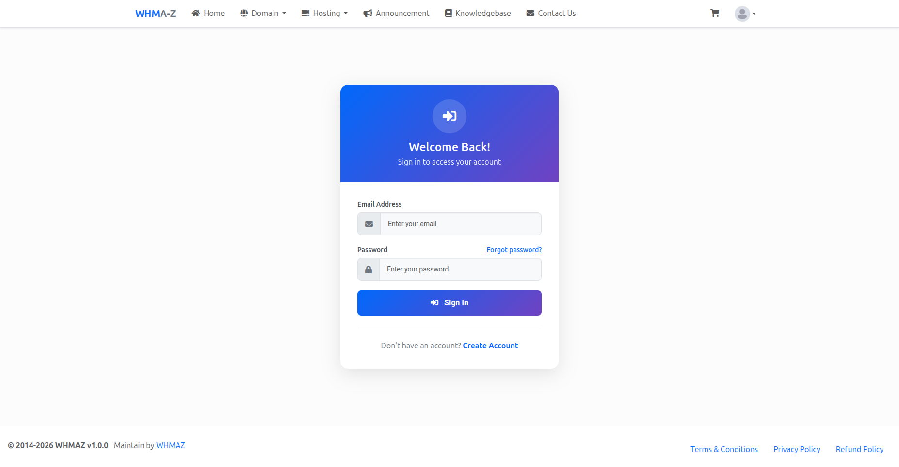
*[Screenshot Placeholder: Customer portal login page]*

### Admin Portal Access

**URL Format:**
```
https://yourdomain.com/whmazadmin
```

**Login Page Elements:**
- Email address field
- Password field
- Google reCAPTCHA checkbox (if configured in General Settings)
- "Forgot Password?" link

**reCAPTCHA Protection:**
If Google reCAPTCHA is configured in the admin General Settings, the admin login page will display a reCAPTCHA checkbox to prevent automated brute force attacks. Complete the "I'm not a robot" verification before clicking Sign In.

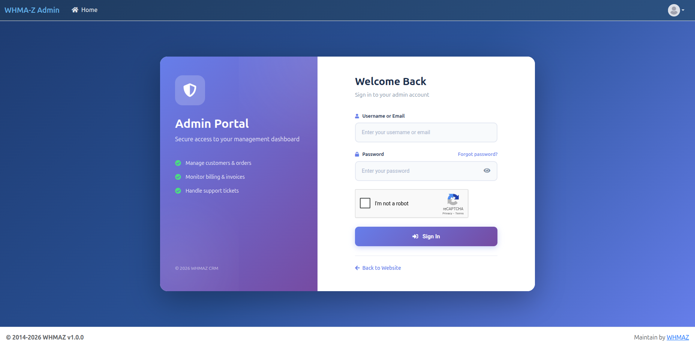
*[Screenshot Placeholder: Admin portal login page]*

### Security Features

- **CSRF Protection:** All forms protected against cross-site request forgery
- **XSS Prevention:** All outputs sanitized
- **Session Security:** Secure session management with database storage
- **Password Security:** bcrypt hashing with strong password requirements
- **Login Attempt Limiting:** Protection against brute force attacks
- **Google reCAPTCHA:** Bot protection on registration and admin login pages

---

## Default Credentials

### Demo Installation

If you installed with demo data, use these credentials:

**Administrator:**
```
Email: admin@demo.com
Password: Admin@123
```

**Demo Customer:**
```
Email: customer@demo.com
Password: Customer@123
```

### Fresh Installation

If you installed without demo data:

**Administrator:**
- Email: (set during installation)
- Password: (set during installation)

### ⚠️ IMPORTANT SECURITY STEPS

After first login, immediately:

1. **Change Default Password**
   - Go to Profile Settings
   - Click "Change Password"
   - Use strong password (min 8 characters, mixed case, numbers, symbols)

2. **Update Admin Email**
   - Ensure admin email is your actual business email
   - Used for important system notifications

3. **Delete Demo Users** (if applicable)
   - Remove demo customer accounts
   - Remove demo admin accounts (if multiple exist)

---

# Part 2: Customer Portal Guide

## Customer Registration

### Creating a New Account

1. **Navigate to Registration Page**
   - Go to customer portal
   - Click "Register" or "Sign Up"

2. **Fill Registration Form**
   - **Personal Information:**
     - First Name (required)
     - Last Name (required)
     - Email Address (required, used for login)
     - Phone Number (optional)

   - **Account Security:**
     - Password (required, min 8 characters)
     - Confirm Password (must match)

   - **Company Information:** (optional)
     - Company Name
     - Tax ID/VAT Number

   - **Address Details:**
     - Street Address
     - City
     - State/Province
     - ZIP/Postal Code
     - Country (dropdown selection from countries database)

3. **Complete Security Verification**
   - Complete the Google reCAPTCHA checkbox ("I'm not a robot")
   - This prevents automated bot registrations

4. **Accept Terms**
   - Read Terms of Service
   - Check "I agree" checkbox

5. **Submit Registration**
   - Click "Register" button
   - Check email for verification link
   - Click verification link to activate account

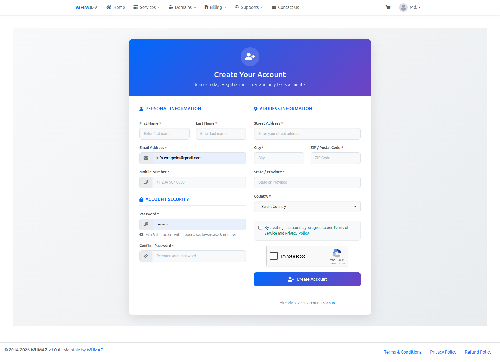
*[Screenshot Placeholder: Customer registration form]*

### Email Verification

After registration, a verification email is automatically sent to your registered email address:

1. Check your email inbox (and spam/junk folder)
2. Open the email from the system titled "Email Verification - [Company Name]"
3. Click the "Verify My Email" link
4. You will be redirected to the login page with a success message
5. Your account is now activated — you can login

**Important:** You cannot login until your email is verified. If you try to login before verifying, you will see a message asking you to check your email.

**Verification URL format:** `https://yourdomain.com/auth/verify/{verification_hash}`

---

## Customer Dashboard

### Dashboard Overview

The customer dashboard provides a comprehensive overview of your account with a modern, professional design:

**Welcome Banner:**
- Personalized greeting with your name
- Quick description of available features
- Quick action buttons:
  - Register Domain
  - Order Service
  - Open Ticket

**Stat Cards (Top Row):**
- **Active Services:** Number of active hosting/service orders with server icon
- **Registered Domains:** Total domain count with globe icon
- **Support Tickets:** Number of support tickets with headset icon
- **Total Invoices:** Invoice count with invoice icon

Each stat card features:
- Gradient icon backgrounds
- Real-time count display
- Click to navigate to detailed list
- Hover animation effects

**Recent Activity Section:**
- **Recent Support Tickets:** Latest tickets with priority and status badges
- **Recent Invoices:** Latest invoices with amounts and payment status
- View All links to full lists
- Refresh buttons for real-time updates


*[Screenshot Placeholder: Customer dashboard with welcome banner and stat cards]*

### Navigation Menu

**Main Menu Items:**
- **Dashboard:** Overview and quick access
- **Services:** View and manage your orders/services
- **Domains:** Manage domain registrations
- **Billing:** View invoices and payment history
- **Support:** Tickets and knowledge base
- **Account:** Profile and settings

---

## Managing Profile

### Updating Personal Information

1. **Access Profile Settings**
   - Click your name in top-right corner
   - Select "Profile" or "Account Settings"

2. **Edit Information**
   - Update name, email, phone
   - Modify address details
   - Update company information
   - Save changes

3. **Change Password**
   - Navigate to `/clientarea/changePassword` or click "Change Password" in your account menu
   - Enter your current password
   - Enter new password (minimum 8 characters)
   - Confirm new password (must match)
   - Click "Change Password"
   - A confirmation email will be sent to your registered email address notifying you of the password change
   - If you did not initiate the change, contact support immediately


*[Screenshot Placeholder: Customer profile settings page]*

### Managing Contact Information

**Primary Contact Details:**
- Name and email cannot be changed without email verification
- Phone number can be updated anytime
- Address updates reflect immediately

**Email Change Process:**
1. Enter new email address
2. System sends verification to new email
3. Click verification link
4. Email is updated after verification

### Setting Preferences

**Notification Preferences:**
- Email notifications for invoices
- Email notifications for tickets
- Email notifications for announcements
- Marketing emails (opt-in/opt-out)

**Display Preferences:**
- Preferred language (if multi-language supported)
- Timezone
- Date format
- Currency display

---

## Ordering Services

### Browsing Available Packages

1. **View Package List**
   - Go to "Order" or "Services" → "New Order"
   - Browse available hosting packages
   - Compare features and pricing

2. **Package Information**
   - Package name and description
   - Features (CPU, RAM, Disk, Bandwidth)
   - Pricing (monthly, quarterly, annually)
   - Setup fee (if applicable)

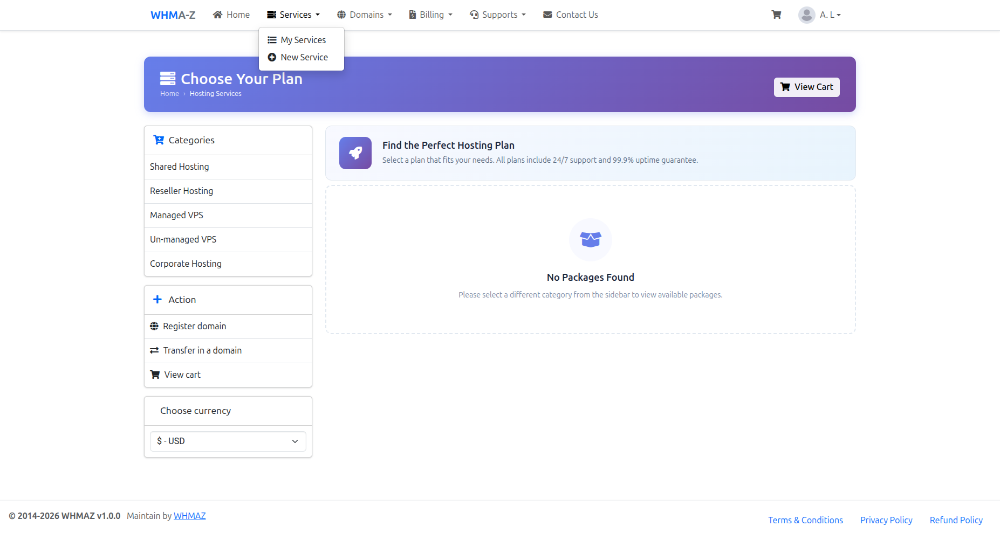
*[Screenshot Placeholder: Available packages with features and pricing]*

### Placing an Order

**Step 1: Select Package**
- Click "Order Now" on desired package
- Choose billing cycle (1 month, 3 months, 6 months, 12 months)
- Select any add-ons or upgrades

**Step 2: Configure Service**
- Enter domain name (if applicable)
- Choose server location (if options available)
- Select operating system or control panel (if applicable)
- Add any custom notes or requirements

**Step 3: Review Order**
- Verify package details
- Check pricing and billing cycle
- Review total amount
- Apply coupon code (if you have one)

**Step 4: Checkout**
- Review order summary
- Accept Terms of Service
- Click "Complete Order" or "Checkout"

**Step 5: Payment**
- Invoice is generated automatically
- Redirected to payment page
- Choose payment method
- Complete payment

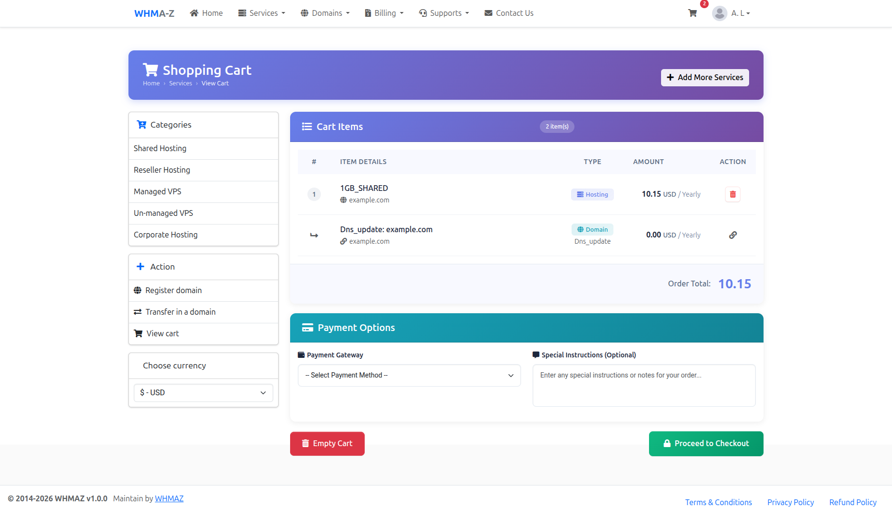
*[Screenshot Placeholder: Order checkout page with order summary]*

### Order Status

**Order Statuses:**
- **Pending:** Order placed, awaiting payment
- **Active:** Service is active and running
- **Suspended:** Service suspended (usually due to non-payment)
- **Cancelled:** Service cancelled
- **Fraud:** Flagged for fraud review

### Managing Existing Orders

1. **View All Orders**
   - Go to "Services" or "My Services"
   - See list of all orders with status

2. **Order Details**
   - Click on order to view details
   - See service specifications
   - View billing information
   - Check next due date

3. **Order Actions**
   - **Upgrade/Downgrade:** Request service change
   - **Renew:** Pay renewal invoice
   - **Cancel:** Request cancellation
   - **Support:** Open ticket for this service

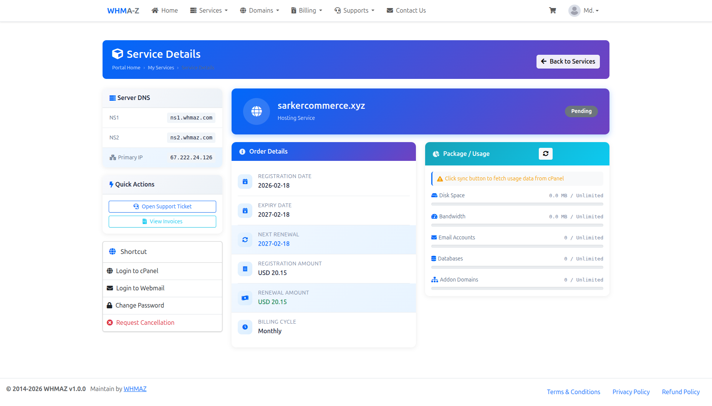
*[Screenshot Placeholder: Service details page with actions]*

---

## Domain Management

### Searching for Domains

1. **Access Domain Search**
   - Go to "Domains" → "Register Domain"
   - Or use search box on homepage

2. **Enter Domain Name**
   - Type desired domain name
   - Select extensions (.com, .net, .org, etc.)
   - Click "Search"

3. **View Results**
   - Available domains shown in green
   - Unavailable domains shown in red
   - Alternative suggestions displayed
   - Pricing shown for each extension

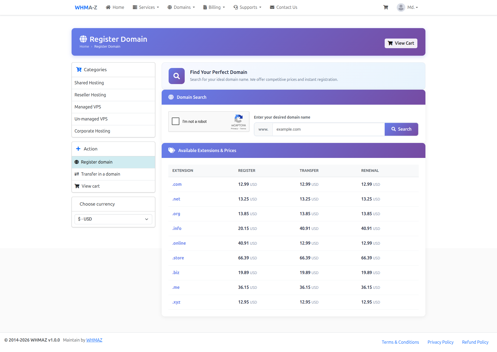
*[Screenshot Placeholder: Domain search results page]*

### Registering a Domain

**Step 1: Select Domain**
- Check boxes next to desired domains
- Review pricing for selected registration period
- Add to cart

**Step 2: Configure Domain**
- Set nameservers (use default or custom)
- Enable WHOIS privacy (if available)
- Select registration period (1-10 years)

**Step 3: Complete Registration**
- Review domain order
- Proceed to checkout
- Invoice generated
- Complete payment

### Managing Domains

**Domain List:**
- View all registered domains
- See expiration dates
- Check renewal status
- Filter by status (Active, Expired, etc.)

**Domain Actions:**
- **Renew:** Pay renewal invoice
- **Transfer:** Initiate domain transfer
- **Nameservers:** Update DNS settings
- **WHOIS:** Update contact information
- **Auto-Renew:** Enable/disable automatic renewal

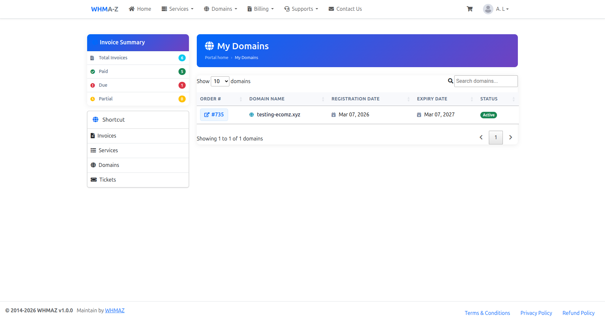
*[Screenshot Placeholder: Domain list with management options]*

### Domain Transfer

**Transferring Domain to Your Account:**

1. **Initiate Transfer**
   - Go to "Domains" → "Transfer Domain"
   - Enter domain name
   - Enter authorization/EPP code

2. **Verify Transfer**
   - System checks domain eligibility
   - Shows transfer pricing
   - Adds 1 year to registration

3. **Complete Transfer**
   - Confirm transfer request
   - Pay transfer fee
   - Approve transfer email (from current registrar)
   - Wait 5-7 days for transfer completion

**Transfer Requirements:**
- Domain must be unlocked at current registrar
- Domain must not be within 60 days of registration
- Valid authorization/EPP code required
- Admin email must be accessible

---

## Viewing Invoices

### Invoice List

1. **Access Invoices**
   - Go to "Billing" → "Invoices"
   - View all invoices (paid and unpaid)

2. **Invoice Information**
   - Invoice number
   - Invoice date
   - Due date
   - Total amount
   - Status (Paid, Unpaid, Cancelled)

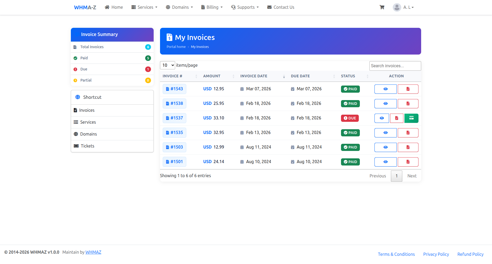
*[Screenshot Placeholder: Invoice list page with filters]*

### Invoice Details

**Click on invoice to view:**
- **Invoice Header:**
  - Company information
  - Your billing address
  - Invoice number and date
  - Due date and status

- **Line Items:**
  - Item description (service, domain, etc.)
  - Quantity
  - Unit price
  - Subtotal

- **Totals:**
  - Subtotal
  - Tax (if applicable)
  - Total amount due

- **Payment Information:**
  - Payment status
  - Payment date (if paid)
  - Payment method used
  - Transaction ID

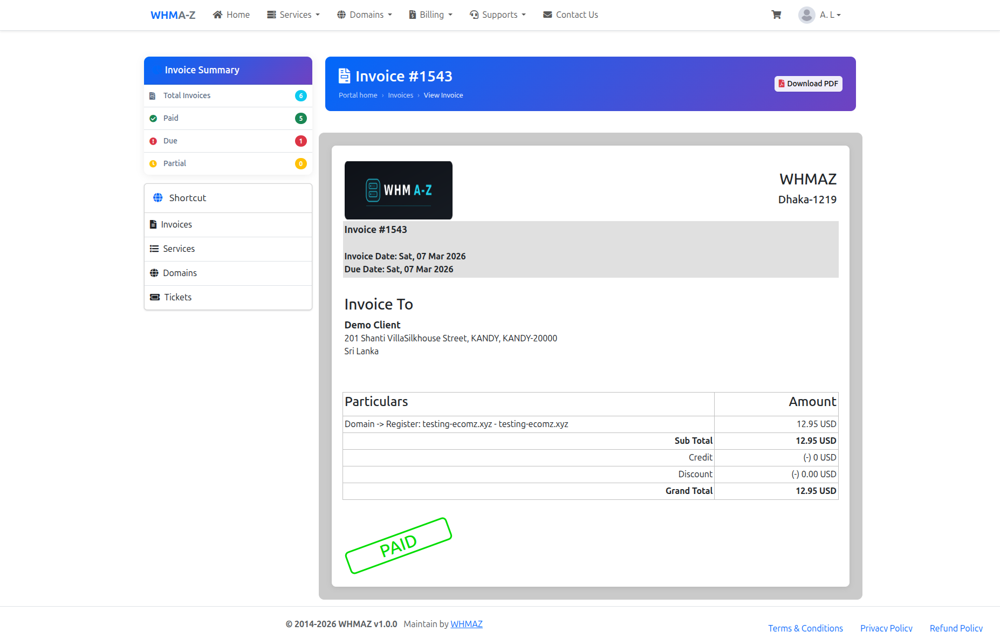
*[Screenshot Placeholder: Invoice details page]*

### Downloading Invoices

- Click "Download PDF" button
- PDF invoice generated
- Suitable for printing or record-keeping
- Contains all invoice details

### Recurring Invoices

**Automatic Invoice Generation:**
- System generates invoices before service expiration
- Invoices sent via email
- Grace period before suspension (typically 3-7 days)
- Reminders sent for unpaid invoices

---

## Making Payments

### Payment Methods

Available payment methods (configured by administrator):
- **Credit/Debit Card** (Stripe, PayPal, etc.)
- **PayPal**
- **Bank Transfer/Wire Transfer**
- **Credit Balance** (if you have account credit)

### Paying an Invoice

1. **Open Unpaid Invoice**
   - Go to "Billing" → "Invoices"
   - Click on unpaid invoice

2. **Select Payment Method**
   - Choose preferred payment method
   - Click "Pay Now"

3. **Complete Payment**
   - For cards: Enter card details
   - For PayPal: Login to PayPal account
   - For bank transfer: View payment instructions
   - Confirm payment

4. **Payment Confirmation**
   - Payment processed
   - Invoice marked as paid
   - Receipt sent via email
   - Service activated/renewed

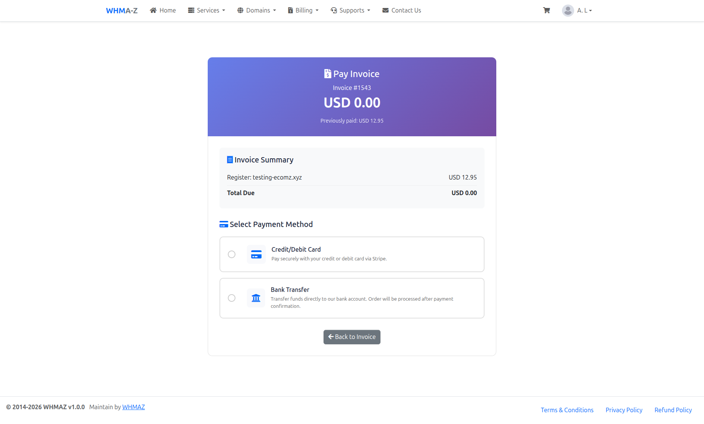
*[Screenshot Placeholder: Payment page with payment method selection]*

### Payment History

**View All Transactions:**
- Go to "Billing" → "Transactions"
- See all completed payments
- Filter by date, amount, or payment method

**Transaction Details:**
- Transaction ID
- Date and time
- Amount paid
- Payment method
- Associated invoice
- Receipt download

### Account Credit

**Adding Credit:**
- Option to add funds to account
- Use credit for future payments
- Automatic deduction from credit balance

**Credit Balance:**
- View current credit balance in dashboard
- Credit automatically applied to new invoices
- Refund to original payment method (if requested)

---

## Support Tickets

### Creating a Support Ticket

1. **Open Ticket Form**
   - Go to "Support" → "Open Ticket"
   - Or click "Get Support" from service details
   - Modern, beautified form with organized sections

2. **Contact Information Section**
   - Name (pre-filled, read-only)
   - Email (pre-filled, read-only)

3. **Ticket Details Section**
   - **Subject:** Brief description of issue (required)
   - **Department:** Select appropriate department (required)
     - Technical Support
     - Billing Support
     - Sales
     - General Inquiry
   - **Related Service:** Select from your active services (optional)
     - Dropdown shows your active hosting accounts with domain names
     - Format: "Product Name (domain.com)"
     - Helps support staff identify the affected service quickly
   - **Priority:** Select urgency level (required)
     - Low (general questions)
     - Medium (minor issues)
     - High (service affecting)
     - Critical (urgent, service down)

4. **Message Section**
   - Rich text editor (Quill) with formatting toolbar
   - Support for bold, italic, underline, lists, links, code blocks
   - Detailed description of your issue

5. **Attachments Section**
   - Upload screenshots or files
   - Allowed types: GIF, JPG, PNG, PDF, TXT
   - Maximum 5MB per file
   - Multiple attachments supported (click + button to add more)

6. **Submit Ticket**
   - Click "Submit Ticket" button
   - Ticket number assigned
   - Confirmation email sent
   - Support team notified

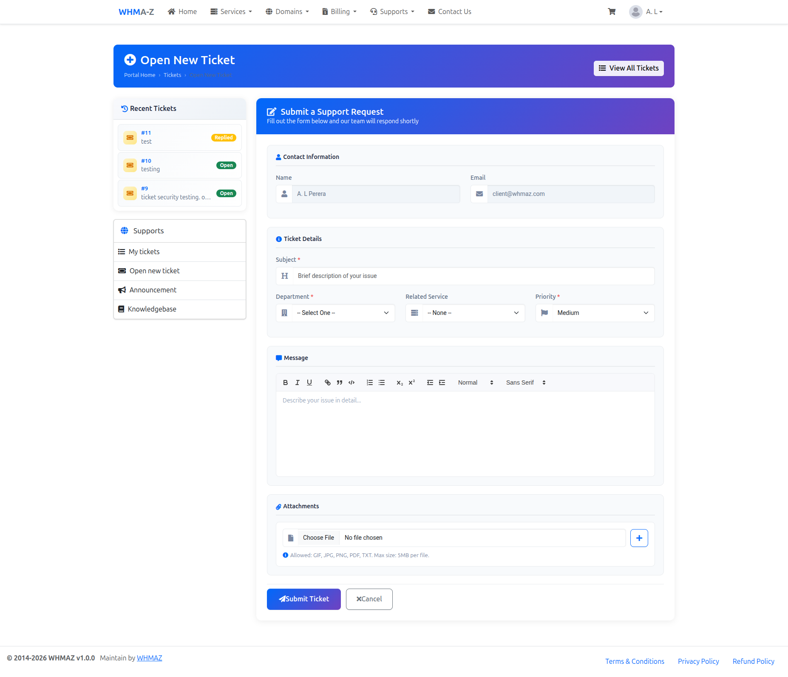
*[Screenshot Placeholder: Create support ticket form with modern design]*

### Managing Tickets

**Ticket List:**
- View all your tickets
- See ticket status:
  - **Open:** New ticket, awaiting response
  - **Pending:** Your response needed
  - **Answered:** Support team replied
  - **Resolved:** Issue resolved
  - **Closed:** Ticket closed

**Ticket Actions:**
- Click ticket to view conversation
- Reply to ticket
- Upload additional files
- Close ticket (if resolved)
- Reopen ticket (if issue persists)

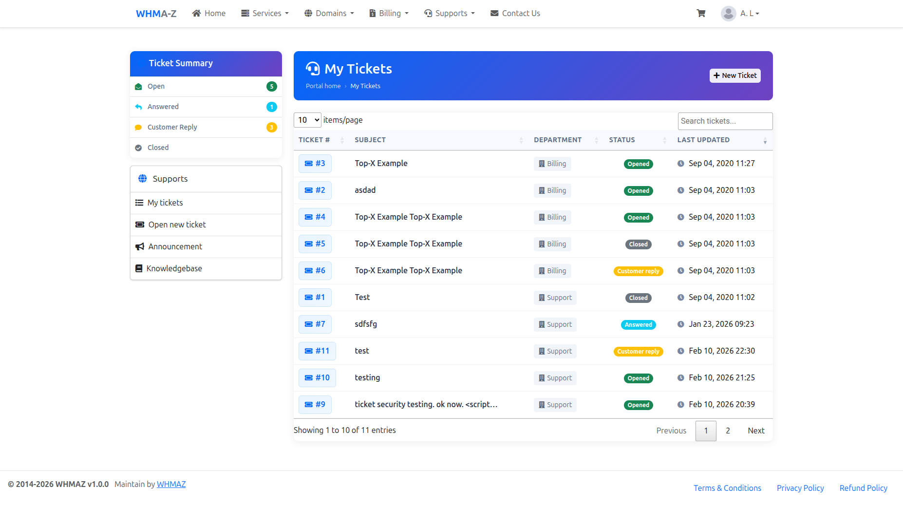
*[Screenshot Placeholder: Support ticket list]*

### Replying to Tickets

1. **Open Ticket**
   - Click on ticket from list
   - View full conversation history in a modern thread layout

2. **Ticket Information Sidebar**
   - Status badge showing current ticket state
   - Department assignment
   - Priority level with color-coded badge
   - Submitted date
   - Last updated date

3. **Conversation Thread**
   - Messages displayed as styled bubbles
   - Color-coded by sender:
     - **Blue border:** Your messages (customer)
     - **Green border:** Staff/Admin replies
     - **Purple border:** Original ticket message
   - Each message shows:
     - Sender name with avatar
     - Timestamp
     - Message content with rich text support
     - Helpful/Not Helpful feedback buttons
     - Attachment links (if any)

4. **Add Reply**
   - Use the rich text editor (Quill) at the top
   - Format text with bold, italic, lists, links, etc.
   - Attach files (GIF, JPG, PNG, PDF, TXT - max 5MB)
   - Click "Send Reply" button

5. **Email Notifications**
   - You receive email when support replies
   - Click link in email to view ticket
   - Reply via portal (not by email reply)

### Best Practices for Support

**For Faster Resolution:**
- ✓ Provide detailed description
- ✓ Include error messages (screenshots helpful)
- ✓ Specify when issue started
- ✓ Mention what you were doing when issue occurred
- ✓ Include relevant URLs or account details
- ✓ Set appropriate priority level
- ✓ Respond promptly to support questions

**Avoid:**
- ✗ Opening multiple tickets for same issue
- ✗ Marking all tickets as urgent
- ✗ Providing incomplete information
- ✗ Expecting instant responses (check SLA)

---

## Knowledge Base

The Knowledge Base is publicly accessible without login, making it easy for visitors to find answers.

### Browsing Articles

1. **Access Knowledge Base**
   - URL: `/supports/KB`
   - No login required (public page)

2. **KB List Page Features**
   - **Search Box:** Filter articles by keyword in real-time
   - **Category Cards:** Visual grid of categories with article counts
   - **Article List:** All articles with icons, tags, and view counts
   - **Sidebar:** Category navigation with article counts
   - **Pagination:** 10 articles per page with page navigation

3. **Browse by Category**
   - Click on any category card or sidebar link
   - URL: `/supports/kb_category/{id}/{slug}`
   - Shows articles filtered by that category
   - Active category highlighted in sidebar

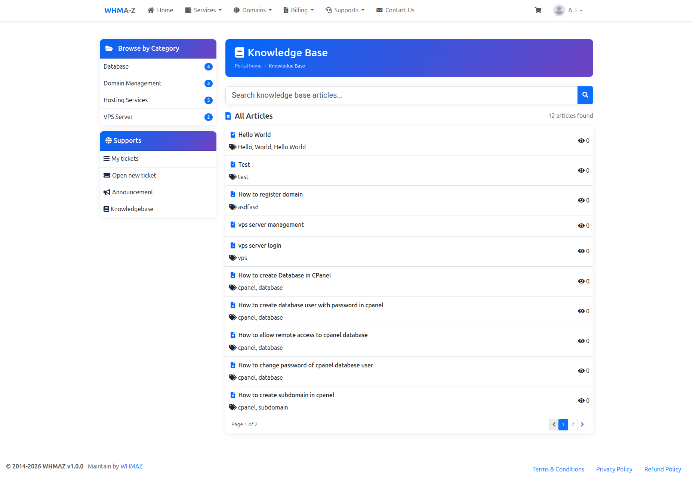
*[Screenshot Placeholder: Knowledge base categories and popular articles]*

### Searching for Articles

1. **Use Search Box**
   - Located at the top of the KB list page
   - Enter keywords or question
   - Articles filter in real-time as you type
   - Results show title, tags, and view count

2. **Filter by Category**
   - Click category card in the grid
   - Or use sidebar category links
   - Each category shows article count

### Reading Articles

**Article Detail Page** (`/supports/view_kb/{id}/{slug}`):

**Article Information:**
- Article title with icon
- Tags for categorization
- View count

**Article Content:**
- Rich formatted content
- Sanitized HTML for security

**Rating System:**
- "Was this article helpful?" prompt
- Thumbs up/down buttons with vote counts
- Helps identify useful content

**Sidebar Navigation:**
- KB category links
- Quick access to other categories
- Support navigation

---

## Announcements

Announcements are publicly accessible without login, keeping visitors informed of important updates.

### Viewing Announcements

1. **Access Announcements**
   - URL: `/supports/announcements`
   - No login required (public page)

2. **Announcement List Features**
   - **List View:** All announcements with icons and view counts
   - **Archive Sidebar:** Year-month grouping (e.g., "February 2026 (5)")
   - **Pagination:** 10 announcements per page

3. **Browse by Archive**
   - Click on any month in the Archive sidebar
   - URL: `/supports/announcements_archive/{year}/{month}`
   - Shows announcements from that specific month
   - Active month highlighted in sidebar

### Reading Announcements

**Announcement Detail Page** (`/supports/view_announcement/{id}/{slug}`):

**Announcement Information:**
- Title with icon
- Tags (if any)
- View count

**Content:**
- Full announcement content
- Sanitized HTML for security

**Share Buttons:**
- Facebook share
- Twitter share
- LinkedIn share
- Copy link to clipboard

**Archive Navigation:**
- Year-month archive links in sidebar
- Quick access to other months
- Support navigation

---

# Part 3: Administrator Portal Guide

## Admin Dashboard

### Dashboard Overview

The admin dashboard provides comprehensive business insights:

**Key Metrics (Top Row):**
- **Total Revenue:** Revenue for selected period
- **Active Orders:** Count of active services
- **Pending Invoices:** Unpaid invoice count and amount
- **Open Tickets:** Support tickets requiring attention


*[Screenshot Placeholder: Admin dashboard with metrics and charts]*

### Dashboard Widgets

**Summary Cards (Top Row):**
- **Customers:** Total active customer count
- **Orders:** Total active orders count
- **Tickets:** Total open support tickets count
- **Invoices:** Total invoices count

**Pending Orders:**
- Latest pending orders list
- Order number and amount
- Payment status indicator (Paid/Due/Partial)
- Link to order details

**Recent Support Tickets:**
- Latest support tickets
- Priority indicator (Low/Medium/High/Critical)
- Status badges (Opened/Answered/Customer Reply/Closed)
- Quick link to ticket view

**Recent Invoices:**
- Latest invoices with amounts
- Due date display
- Payment status badges
- Link to invoice details

**Last 12 Months Expenses (Chart):**
- Interactive bar chart showing monthly expense totals
- Displays data using Chart.js visualization
- Shows total expenses sum in header
- Auto-fills missing months with zero values
- Refresh button to reload data
- Link to expenses management page

**Domain Selling Prices:**
- Table showing domain extension pricing
- Columns: Extension, Register, Transfer, Renewal
- Color-coded prices for easy reading
- Currency symbol from configuration
- Scrollable list (up to 10 extensions)
- Link to domain pricing management

### Quick Actions

**Accessible from Dashboard:**
- Create New Customer
- Create New Order
- Generate Invoice
- Create Support Ticket
- Add Knowledge Base Article
- View Reports

---

## Customer Management

### Customer List

1. **Access Customer Management**
   - Go to "Customers" → "Manage Customers"
   - View all customer accounts

2. **Customer List Features**
   - Server-side pagination (fast for large datasets)
   - Search by name, email, phone, company
   - Filter by status (Active, Inactive)
   - Sort by any column
   - Export to CSV/Excel

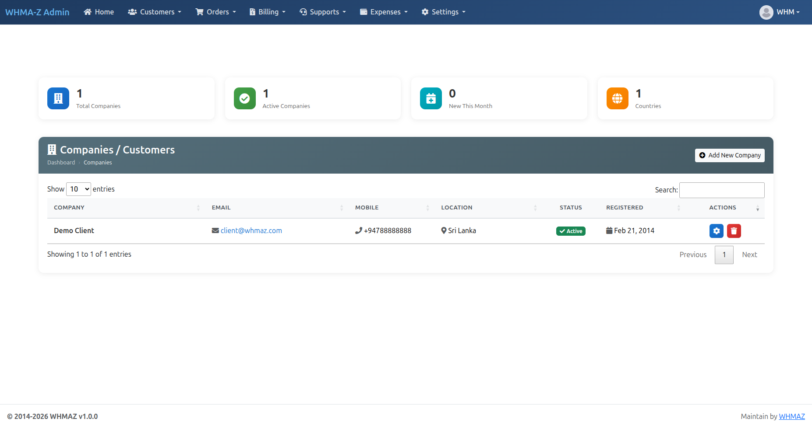
*[Screenshot Placeholder: Customer management with DataTables pagination]*

### Customer Details

**Click on customer to view:**
- **Personal Information:**
  - Name, email, phone
  - Company name
  - Address details
  - Tax ID
  - Registration date

- **Account Statistics:**
  - Total orders
  - Active services
  - Total revenue
  - Outstanding balance
  - Last login date

- **Related Records:**
  - All orders/services
  - All invoices
  - All payments
  - All support tickets
  - Notes and comments

### Adding a New Customer

1. **Click "Add Customer"**
   - Fill in customer form
   - Enter all required fields

2. **Customer Information**
   - **Personal Details:**
     - First Name (required)
     - Last Name (required)
     - Email (required, must be unique)
     - Phone Number

   - **Company Information:**
     - Company Name
     - Tax ID/VAT Number

   - **Address:**
     - Street Address
     - City
     - State/Province
     - ZIP/Postal Code
     - Country

   - **Account Settings:**
     - Password (auto-generated or manual)
     - Send welcome email (checkbox)
     - Account status (Active/Inactive)

3. **Save Customer**
   - Click "Save"
   - Customer account created
   - Welcome email sent (if enabled)
   - Customer can now login

### Editing Customer Information

1. **Find Customer**
   - Search in customer list
   - Click "Edit" button

2. **Update Information**
   - Modify any field except email (requires verification)
   - Update address
   - Change status
   - Reset password (if needed)

3. **Save Changes**
   - Click "Save"
   - Customer notified of changes (if applicable)

### Customer Actions

**Available Actions:**
- **View Orders:** See all customer orders
- **View Invoices:** See billing history
- **View Tickets:** See support history
- **Create Order:** Create order for this customer
- **Generate Invoice:** Create manual invoice
- **Send Email:** Send direct message
- **Add Note:** Internal notes about customer
- **Login as Customer:** (for troubleshooting)
- **Suspend Account:** Temporarily disable
- **Delete Customer:** Permanently remove (with confirmation)

---

## Order Management

### Order List

1. **Access Order Management**
   - Go to "Orders" → "Manage Orders"
   - View all orders/services

2. **Order List Information**
   - Order ID
   - Customer name
   - Package/Service name
   - Amount
   - Billing cycle
   - Next due date
   - Status
   - Actions

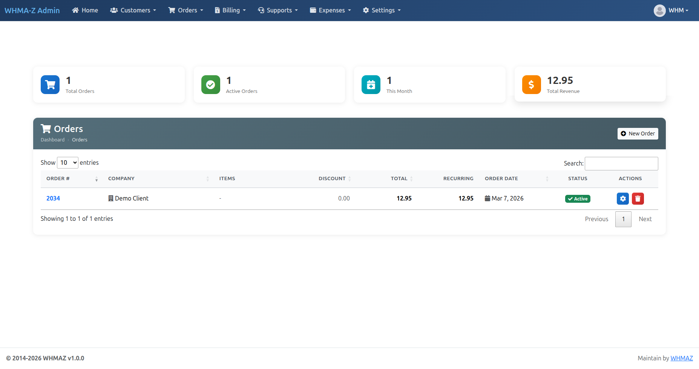
*[Screenshot Placeholder: Order management list with filters and search]*

### Creating an Order (Manual)

**When to Create Manual Order:**
- Phone order from customer
- Offline sale
- Custom service not in catalog
- Migration from another system

**Steps:**

1. **Click "New Order"**
   - Select customer (or create new)
   - Choose package

2. **Order Details**
   - Select billing cycle
   - Choose start date
   - Set custom pricing (if applicable)
   - Add setup fee (if applicable)

3. **Service Configuration**
   - Enter domain name
   - Set server location
   - Configure options
   - Add special notes

4. **Pricing Override** (optional)
   - Override standard pricing
   - Add discounts
   - Add custom line items

5. **Generate Invoice**
   - Auto-generate invoice (checkbox)
   - Set invoice due date
   - Send invoice to customer (checkbox)

6. **Save Order**
   - Order created
   - Invoice generated (if enabled)
   - Email sent to customer (if enabled)

### Order Status Management

**Order Statuses:**
- **Pending:** Awaiting payment or approval
- **Active:** Service is active
- **Suspended:** Temporarily disabled (non-payment, violation, etc.)
- **Cancelled:** Service cancelled
- **Fraud:** Flagged for manual review

**Changing Order Status:**
1. Open order details
2. Select new status from dropdown
3. Add reason/note (optional)
4. Save changes
5. Customer notified via email

### Order Actions

**Available Actions:**
- **Edit Order:** Modify order details
- **Change Package:** Upgrade/downgrade
- **Suspend Service:** Temporarily disable
- **Unsuspend Service:** Reactivate
- **Cancel Order:** Permanently cancel
- **Generate Invoice:** Create renewal invoice
- **View Invoices:** See related invoices
- **Add Notes:** Internal notes
- **Send Email:** Notify customer

### Bulk Operations

**Select Multiple Orders:**
- Check boxes next to orders
- Select bulk action:
  - Suspend selected
  - Activate selected
  - Generate invoices
  - Send reminder emails
  - Export selected
  - Delete selected

---

## Package Management

### Package List

1. **Access Packages**
   - Go to "Products" → "Packages"
   - View all hosting packages

2. **Package Information**
   - Package name
   - Package group/category
   - Pricing
   - Status (Active/Hidden)
   - Order (display order)

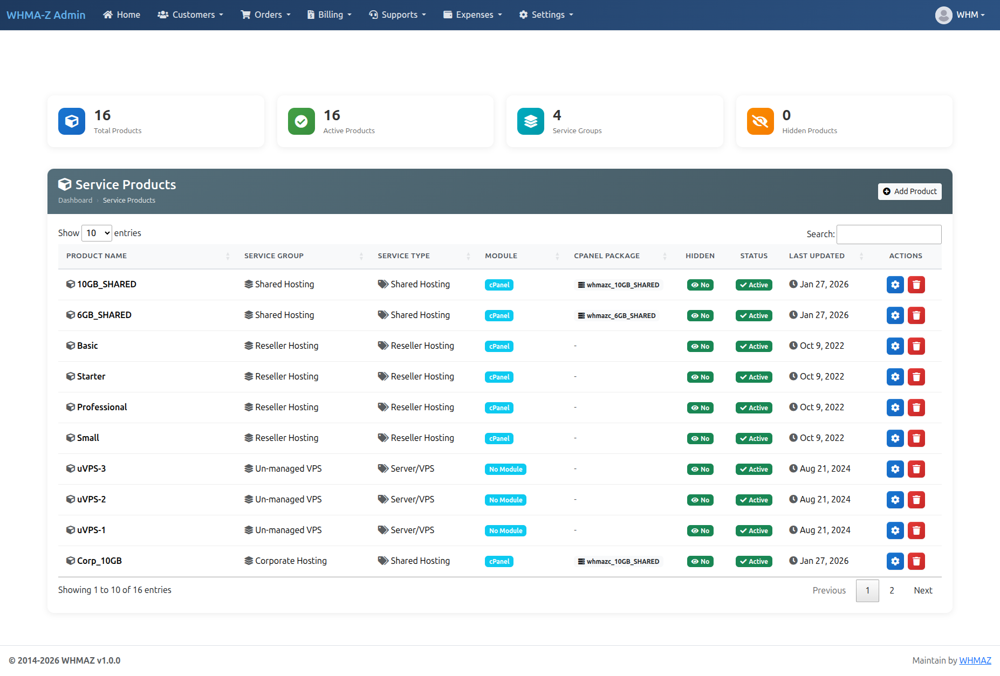
*[Screenshot Placeholder: Package management list]*

### Creating a Package

1. **Click "Add Package"**
   - Open package creation form

2. **Basic Information**
   - **Package Name:** Display name (e.g., "Starter Hosting")
   - **Package Group:** Category (Shared, VPS, Dedicated, etc.)
   - **Description:** Detailed description
   - **Features:** Bullet points of features
   - **Status:** Active (visible) or Hidden

3. **Specifications**
   - **CPU Cores:** Number of CPU cores
   - **RAM:** Memory allocation (MB/GB)
   - **Disk Space:** Storage allocation (GB/TB)
   - **Bandwidth:** Monthly transfer limit (GB/TB/Unlimited)
   - **Email Accounts:** Number allowed
   - **Databases:** Number allowed
   - **Subdomains:** Number allowed
   - **FTP Accounts:** Number allowed

4. **Pricing**
   - **Setup Fee:** One-time setup cost
   - **Monthly Price:** Recurring monthly cost
   - **Quarterly Price:** 3-month pricing
   - **Semi-Annual Price:** 6-month pricing
   - **Annual Price:** 12-month pricing
   - **Bi-Annual Price:** 24-month pricing
   - **Tri-Annual Price:** 36-month pricing

5. **Additional Options**
   - **Allow Upgrades:** Can customers upgrade?
   - **Allow Downgrades:** Can customers downgrade?
   - **Auto-Setup:** Automatically provision?
   - **Welcome Email:** Send welcome email?
   - **Order:** Display position (lower = higher priority)

6. **Save Package**
   - Click "Save"
   - Package available for ordering
   - Appears in customer portal (if Active)

### Editing Packages

1. **Find Package**
   - Locate in package list
   - Click "Edit"

2. **Modify Details**
   - Update any field
   - Change pricing
   - Modify features
   - Adjust specifications

3. **Price Changes**
   - New prices apply to new orders only
   - Existing orders keep original pricing
   - Can manually adjust existing orders if needed

4. **Save Changes**
   - Click "Save"
   - Changes effective immediately

### Package Groups

**Organizing Packages:**
- Create package groups (categories)
- Group related packages
- Examples:
  - Shared Hosting
  - VPS Hosting
  - Dedicated Servers
  - Reseller Hosting
  - Email Hosting

**Managing Groups:**
- Create new group
- Edit group name
- Set group display order
- Hide/show entire group

---

## Service Product Management

### Service Product List

1. **Access Service Products**
   - Go to "Products" → "Service Products"
   - View all service products with server-side pagination

2. **Product List Information**
   - Product name
   - Service group
   - Service type (Shared Hosting, Reseller Hosting, VPS, etc.)
   - Module (cPanel, etc.)
   - cPanel package (if applicable)
   - Hidden/Active status
   - Last updated date
   - Actions (Manage, Delete)

### Creating a Service Product

1. **Click "Add"**
   - Opens the service product creation form

2. **Basic Information**
   - **Product Name:** Display name (e.g., "Basic Shared Hosting")
   - **Service Group:** Select from configured service groups
   - **Service Type:** Select type (Shared Hosting, Reseller Hosting, VPS, Dedicated, etc.)
   - **Module:** Select provisioning module (cPanel, etc.)
   - **Server:** Select which server hosts this product
   - **Hidden:** Check to hide product from client area

3. **cPanel Package Selection** (Shared Hosting / Reseller Hosting with cPanel module only)
   - When service type is **Shared Hosting** or **Reseller Hosting** and module is **cPanel**, a dynamic dropdown appears
   - Select the server first, then available cPanel packages are loaded automatically from the WHM server
   - Selecting a package auto-fills the **Product Description** with package details:
     - Disk Space
     - Bandwidth
     - Max Addon Domains
     - Max Subdomains
     - Max FTP Accounts
     - Max Email Accounts
     - Max Databases
     - Shell Access
     - CGI Access

4. **Product Description**
   - Rich text description of the product
   - Auto-populated from cPanel package details (editable)
   - Displayed to customers when ordering

5. **Save Product**
   - Click "Save"
   - Product available for assignment to orders

### Editing Service Products

1. **Find Product**
   - Search in the product list
   - Click "Manage" button (wrench icon)

2. **Modify Details**
   - Update any field
   - Change service group, type, or module
   - Re-select cPanel package if needed
   - Toggle hidden status

3. **Save Changes**
   - Click "Save"
   - Changes effective immediately

### Deleting Service Products

- Click the "Delete" button (trash icon) in the product list
- Confirm deletion in the popup dialog
- Products are soft-deleted (can be recovered from database)

---

## Email Template Management

### Overview

Email Template Management allows you to create, edit, and manage all email templates used throughout the system. Templates support rich text editing via the Quill editor and a placeholder system for dynamic content.

**Access:** `whmazadmin/email_template`

### Email Template List

1. **Access Email Templates**
   - Go to "Settings" → "Email Templates"
   - View all templates with server-side pagination

2. **Template List Columns**
   - Template Name
   - Template Key (unique identifier, displayed in `<code>` format)
   - Subject
   - Category (color-coded badge)
   - Status (Active/Inactive)
   - Last Updated
   - Actions (Edit, Delete)

3. **Category Color Codes**
   - **DUNNING** — Yellow/Warning badge
   - **INVOICE** — Blue/Info badge
   - **ORDER** — Primary badge
   - **AUTH** — Secondary badge
   - **SUPPORT** — Green/Success badge
   - **SERVICE** — Teal badge
   - **GENERAL** — Dark badge

### Creating an Email Template

1. **Click "Add"**
   - Opens the email template form

2. **Template Information**
   - **Template Name:** Display name (e.g., "First Payment Reminder")
   - **Template Key:** Unique identifier used in code (e.g., `dunning_first_reminder`). Must be alphanumeric with underscores/dashes only. Cannot be duplicated.
   - **Category:** Select from DUNNING, INVOICE, ORDER, SERVICE, SUPPORT, AUTH, or GENERAL
   - **Subject:** Email subject line (supports placeholders)
   - **Status:** Active checkbox (checked = active)

3. **Email Body**
   - Rich text editor (Quill) with formatting toolbar
   - Supports: bold, italic, underline, strikethrough, lists, links, colors, alignment, and more
   - Write your email content with placeholders for dynamic data

4. **Available Placeholders**
   - `{client_name}` — Customer's full name
   - `{invoice_no}` — Invoice number
   - `{amount_due}` — Outstanding amount
   - `{due_date}` — Invoice due date
   - `{days_overdue}` — Number of days past due
   - `{invoice_url}` — Direct link to the invoice
   - `{currency}` — Currency symbol/code
   - `{site_name}` — Your website/company name
   - `{site_url}` — Your website URL

5. **Save Template**
   - Click "Save"
   - Template available for use in the system

### Editing Email Templates

1. **Find Template**
   - Search or browse in the template list
   - Click "Manage" button (wrench icon)

2. **Modify Details**
   - Update any field except template_key (should remain consistent)
   - Edit the email body using the Quill editor
   - Toggle active status

3. **Save Changes**
   - Click "Save"
   - Changes effective immediately

### Deleting Email Templates

- Click the "Delete" button (trash icon) in the template list
- Confirm deletion in the SweetAlert2 popup dialog
- Templates are soft-deleted (can be recovered from database)

### Default Templates

The system comes with 10 pre-configured email templates:

| Template Key | Category | Purpose |
|-------------|----------|---------|
| `dunning_first_reminder` | DUNNING | First payment reminder |
| `dunning_second_reminder` | DUNNING | Second payment reminder |
| `dunning_final_notice` | DUNNING | Final notice before action |
| `dunning_suspension_notice` | DUNNING | Service suspension notification |
| `dunning_termination_notice` | DUNNING | Service termination notification |
| `invoice_generated` | INVOICE | New invoice notification |
| `invoice_payment_confirmation` | INVOICE | Payment received confirmation |
| `order_confirmation` | ORDER | Order placed confirmation |
| `auth_welcome` | AUTH | Welcome email for new customers |
| `auth_password_reset` | AUTH | Password reset instructions |

**Files:**
- Controller: `src/controllers/whmazadmin/Email_template.php`
- Model: `src/models/Emailtemplate_model.php`
- Views: `src/views/whmazadmin/email_template/email_template_list.php`, `email_template_manage.php`
- Database Table: `email_templates`

---

## Dunning Rules Management

### Overview

Dunning rules automate the process of collecting overdue payments by defining a sequence of actions (email reminders, service suspension, termination) that occur at specified intervals after an invoice becomes overdue.

**Access:** `whmazadmin/general_setting/manage?tab=dunning`

### Accessing Dunning Rules

1. **Navigate to General Settings**
   - Go to "Settings" → "General Settings"
   - Click the "Dunning" tab

2. **Dunning Tab Overview**
   - Information alert explaining the dunning system
   - "Manage Email Templates" shortcut link (opens email template management)
   - "Add Rule" button
   - Rules table with all configured dunning steps
   - Workflow preview card showing the dunning sequence visually

### Creating a Dunning Rule

1. **Click "Add Rule"**
   - Opens the dunning rule modal dialog

2. **Rule Configuration**
   - **Step Number:** Sequential order of the rule (e.g., 1, 2, 3). Must be unique — the system validates for duplicates.
   - **Days After Due:** Number of days after the invoice due date to trigger this action (e.g., 3, 7, 14, 30)
   - **Action Type:** Select from:
     - **EMAIL** — Send a reminder email to the customer
     - **SUSPEND** — Suspend the customer's service
     - **TERMINATE** — Terminate the customer's service
   - **Email Template:** Select a dunning email template from the dropdown (populated from DUNNING category templates). Only shown when action type involves email notification.
   - **Active:** Checkbox to enable/disable the rule

3. **Save Rule**
   - Click "Save"
   - Rule added to the dunning workflow
   - Workflow preview updates automatically

### Action Type Color Codes

- **EMAIL** — Blue badge
- **SUSPEND** — Yellow/Warning badge
- **TERMINATE** — Red/Danger badge

### Editing Dunning Rules

1. **Click Edit** (pencil icon) on the rule row
2. Modal opens pre-filled with current values
3. Modify any field
4. Click "Save"

### Deleting Dunning Rules

1. **Click Delete** (trash icon) on the rule row
2. Confirm deletion in the SweetAlert2 popup
3. Rule permanently removed

### Workflow Preview

The Dunning tab includes a visual workflow preview card that shows all active rules in sequence:
- Each step displayed as a card with step number, days after due, and action type
- Color-coded by action type (blue for email, yellow for suspend, red for terminate)
- Helps visualize the complete dunning sequence at a glance

### Example Dunning Configuration

| Step | Days After Due | Action | Template |
|------|---------------|--------|----------|
| 1 | 3 days | EMAIL | First Payment Reminder |
| 2 | 7 days | EMAIL | Second Payment Reminder |
| 3 | 14 days | EMAIL | Final Notice |
| 4 | 21 days | SUSPEND | Suspension Notice |
| 5 | 30 days | TERMINATE | Termination Notice |

**Files:**
- Controller: `src/controllers/whmazadmin/General_setting.php` (dunning AJAX methods)
- Model: `src/models/Dunningrule_model.php`
- View: `src/views/whmazadmin/general_setting_manage.php` (Dunning tab)
- Database Tables: `dunning_rules`, `dunning_log`

---

## Domain Pricing Management

### Accessing Domain Pricing

1. **Navigate to Domain Pricing**
   - Go to "Domains" → "Domain Pricing"
   - View all TLD pricing configurations

2. **Pricing List Display**
   - Domain extension (.com, .net, .org, etc.)
   - Currency
   - Registration period (years)
   - Registration price
   - Transfer price
   - Renewal price
   - Status

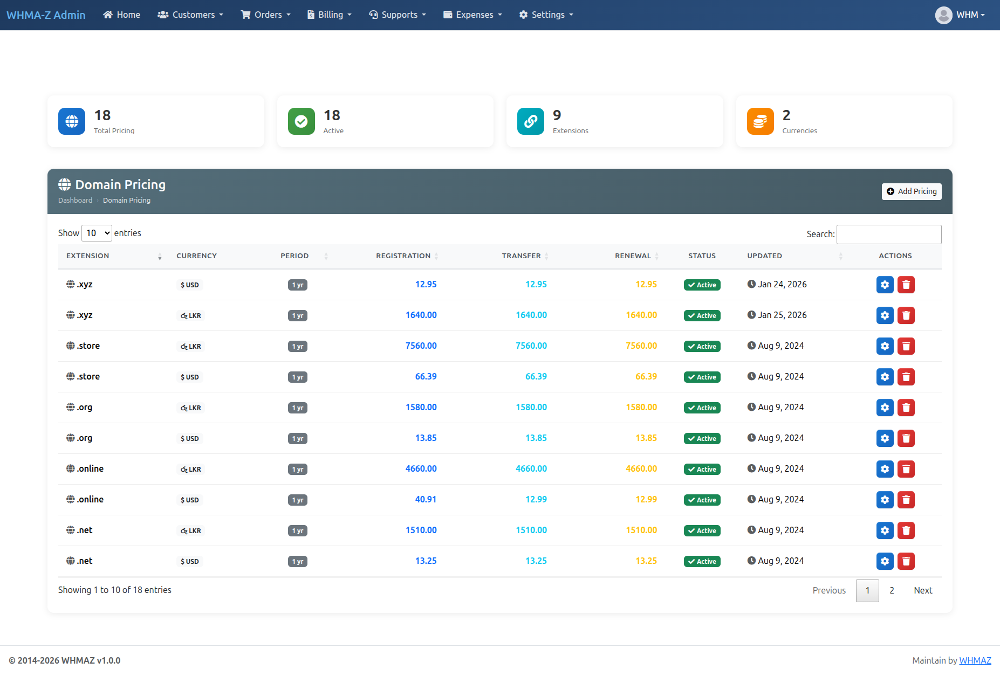
*[Screenshot Placeholder: Domain pricing management with SSP pagination]*

### Adding Domain Pricing

1. **Click "Add Pricing"**
   - Opens pricing configuration form

2. **Select Extension**
   - Choose from available TLDs
   - Extensions from domain_extensions table
   - Examples: .com, .net, .org, .info, .biz

3. **Select Currency**
   - Choose currency for pricing
   - Multiple currencies supported
   - Examples: USD, EUR, GBP

4. **Set Registration Period**
   - Number of years
   - Typically 1-10 years
   - Most common: 1 year

5. **Configure Pricing**
   - **Registration Price:** Cost to register new domain
   - **Transfer Price:** Cost to transfer domain in
   - **Renewal Price:** Cost to renew existing domain

6. **Save Pricing**
   - Click "Save"
   - Pricing active immediately
   - Appears in domain search for customers

### Editing Domain Pricing

1. **Locate Pricing Entry**
   - Use search or filter
   - Find extension + currency + period combination

2. **Click "Edit"**
   - Modify any price field
   - Update registration, transfer, or renewal pricing

3. **Save Changes**
   - New pricing applies to new orders immediately
   - Existing orders unaffected
   - Renewals use current pricing at renewal time

### Managing TLD Extensions

**Domain Extensions Table:**
- Located in database: `dom_extensions`
- Contains available TLDs
- Enable/disable specific TLDs

**Adding New TLD:**
1. Insert into `dom_extensions` table
2. Add pricing in Domain Pricing page
3. TLD appears in domain search

**Popular TLDs:**
- .com, .net, .org (most common)
- .info, .biz, .name
- .io, .co, .me
- Country codes: .us, .uk, .ca, etc.

---

## Invoice Management

### Invoice List

1. **Access Invoice Management**
   - Go to "Billing" → "Invoices"
   - View all invoices

2. **Invoice List Columns**
   - Invoice number
   - Customer name
   - Invoice date
   - Due date
   - Total amount
   - Status (Paid, Unpaid, Cancelled)
   - Actions

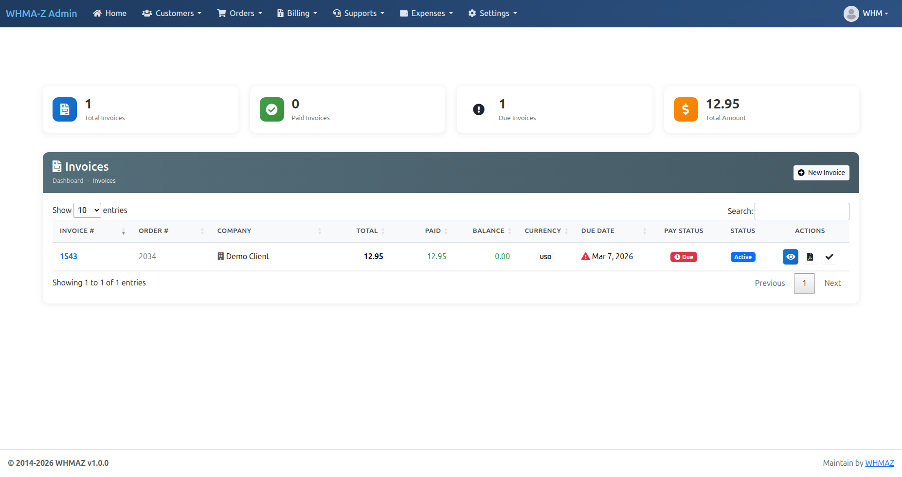
*[Screenshot Placeholder: Invoice management list]*

### Creating Manual Invoice

**When to Create Manual Invoice:**
- Custom service not in system
- One-time charge
- Adjustment or credit
- Offline sale

**Steps:**

1. **Click "Create Invoice"**
   - Select customer
   - Set invoice date and due date

2. **Add Line Items**
   - Click "Add Item"
   - Enter description
   - Enter amount
   - Set quantity (usually 1)
   - Set tax (if applicable)
   - Can add multiple items

3. **Invoice Totals**
   - Subtotal calculated automatically
   - Tax calculated (if configured)
   - Total amount displayed

4. **Notes** (optional)
   - Add notes to customer (visible on invoice)
   - Add admin notes (internal only)

5. **Save Invoice**
   - Click "Save"
   - Invoice generated
   - Option to send to customer

### Editing Invoices

**Editing Allowed for:**
- Unpaid invoices only
- Can modify line items
- Can change amounts
- Can adjust due date

**Cannot Edit:**
- Paid invoices (read-only)
- Use credit notes instead for corrections

**Steps:**
1. Open invoice
2. Click "Edit"
3. Modify line items or amounts
4. Save changes
5. Optionally resend to customer

### Recording Payments

**Manual Payment Recording:**
- For offline payments (cash, check, wire transfer)
- For payments received outside system

**Steps:**

1. **Open Unpaid Invoice**
   - Find invoice in list
   - Click to open

2. **Click "Record Payment"**
   - Enter payment amount
   - Select payment method
   - Enter transaction ID (optional)
   - Enter payment date
   - Add payment notes

3. **Save Payment**
   - Invoice marked as paid
   - Payment recorded in transaction history
   - Customer notified via email (optional)

### Invoice Actions

**Available Actions:**
- **View Invoice:** See full details
- **Edit Invoice:** Modify (unpaid only)
- **Send Invoice:** Email to customer
- **Record Payment:** Manual payment entry
- **Download PDF:** Generate PDF version
- **Cancel Invoice:** Mark as cancelled
- **Delete Invoice:** Permanently remove (with confirmation)

### Recurring Invoices

**Automatic Invoice Generation:**
- System generates invoices before service expiration
- Configured in cron jobs
- Typically 7-14 days before due date

**Settings:**
- Invoice generation frequency
- Days before due date
- Email reminders
- Grace period before suspension

---

## Payment Management

### Transaction History

1. **View All Transactions**
   - Go to "Billing" → "Transactions"
   - See all payment records

2. **Transaction Information**
   - Transaction ID
   - Customer name
   - Invoice number
   - Amount
   - Payment method
   - Transaction date
   - Status (Success, Pending, Failed, Refunded)

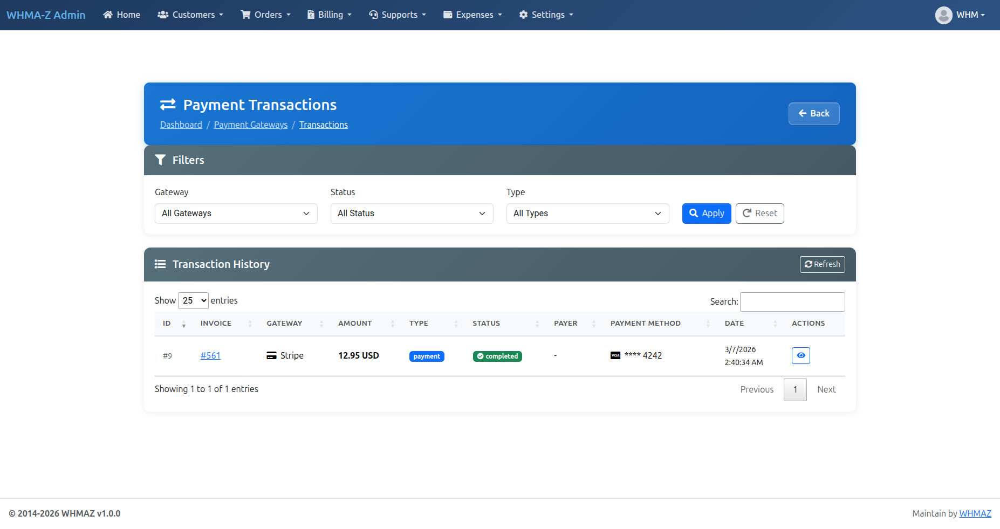
*[Screenshot Placeholder: Transaction history list]*

### Payment Methods

**Configure Payment Gateways:**
- Go to "Settings" → "Payment Gateways"
- Enable/disable payment methods
- Configure API credentials

**Supported Gateways:**
- Credit/Debit Cards (Stripe, etc.)
- PayPal
- Bank Transfer (manual processing)
- More via plugins

### Refunding Payments

1. **Find Transaction**
   - Locate in transaction history
   - Click to view details

2. **Process Refund**
   - Click "Refund" button
   - Enter refund amount (full or partial)
   - Enter refund reason
   - Confirm refund

3. **Refund Processing**
   - Refund processed through payment gateway
   - Transaction updated to "Refunded"
   - Customer notified
   - Invoice status updated

---

## Ticket Management

### Ticket List

1. **Access Ticket Management**
   - Go to "Support" → "Manage Tickets"
   - View all support tickets

2. **Ticket List Columns**
   - Ticket ID
   - Customer name
   - Subject
   - Department
   - Priority
   - Status
   - Last update
   - Actions

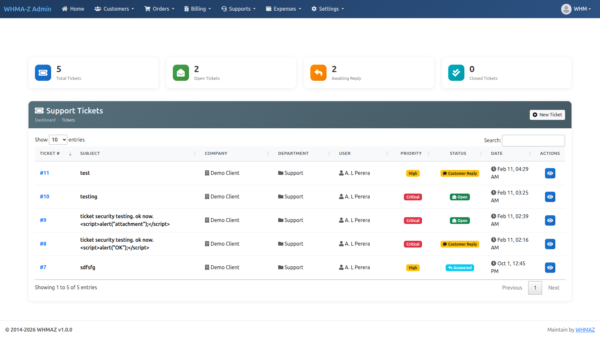
*[Screenshot Placeholder: Support ticket management with filters]*

### Viewing and Replying to Tickets

1. **Open Ticket**
   - Click on ticket from list
   - View full conversation

2. **Ticket Details**
   - Customer information
   - Related service (if applicable)
   - Priority level
   - Department
   - All messages in conversation
   - Attached files

3. **Reply to Customer**
   - Type response in reply box
   - Attach files if needed
   - Click "Reply"
   - Customer notified via email

4. **Internal Notes** (optional)
   - Add notes visible only to staff
   - Useful for documentation
   - Not sent to customer

### Ticket Assignment

**Assigning Tickets:**
- Assign to specific staff member
- Assign to department
- Auto-assignment based on department (if configured)

**Steps:**
1. Open ticket
2. Select staff member from dropdown
3. Save assignment
4. Assigned staff notified

### Ticket Status Management

**Available Statuses:**
- **Open:** New ticket, awaiting response
- **Pending:** Waiting for customer response
- **Answered:** Staff replied, awaiting customer
- **Resolved:** Issue fixed, awaiting closure
- **Closed:** Ticket closed

**Changing Status:**
1. Open ticket
2. Select new status
3. Optionally add note
4. Save changes
5. Customer notified (for certain statuses)

### Ticket Departments

**Managing Departments:**
- Technical Support
- Billing Support
- Sales
- General Inquiry
- Custom departments

**Department Settings:**
- Department name
- Department email
- Auto-assignment rules
- Email templates

### Canned Responses

**What are Canned Responses?**
- Pre-written reply templates
- For common questions
- Saves time

**Using Canned Responses:**
1. While replying to ticket
2. Click "Canned Responses" button
3. Select appropriate response
4. Customize if needed
5. Send reply

**Managing Canned Responses:**
- Create new responses
- Edit existing
- Organize by category
- Set access permissions

---

## Knowledge Base Management

### Article List

1. **Access Knowledge Base Management**
   - Go to "Support" → "Knowledge Base"
   - View all articles

2. **Article Information**
   - Article title
   - Category
   - Author
   - Published date
   - Status (Published, Draft)
   - Views count

### Creating Articles

1. **Click "New Article"**
   - Open article editor

2. **Article Details**
   - **Title:** Article headline
   - **Category:** Select category
   - **Summary:** Short description
   - **Content:** Full article content
   - **Tags:** Keywords for search
   - **Status:** Draft or Published
   - **Featured:** Show in featured section

3. **Content Editor**
   - Rich text editor (Quill)
   - Format text (bold, italic, lists, etc.)
   - Add images
   - Add links
   - Add code blocks
   - Preview before publishing

4. **SEO Settings** (optional)
   - Meta description
   - Keywords
   - URL slug

5. **Publish Article**
   - Click "Publish" or "Save as Draft"
   - Article appears in knowledge base (if published)
   - Customers can find via search or category browsing

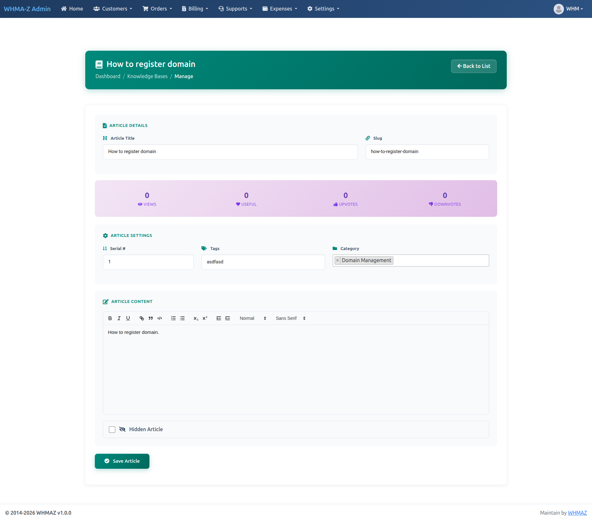
*[Screenshot Placeholder: Knowledge base article editor]*

### Managing Categories

**Article Categories:**
- Organize articles by topic
- Help customers find relevant articles

**Managing Categories:**
1. Go to "Knowledge Base" → "Categories"
2. Create new category
3. Set category name and description
4. Set display order
5. Save category

**Common Categories:**
- Getting Started
- Account Management
- Billing & Payments
- Technical Support
- Troubleshooting
- FAQs

### Editing Articles

1. **Find Article**
   - Locate in article list
   - Click "Edit"

2. **Modify Content**
   - Update any field
   - Change category
   - Update content
   - Add/remove images

3. **Version History** (if enabled)
   - View previous versions
   - Restore old version if needed

4. **Save Changes**
   - Click "Save"
   - Changes reflected immediately

### Article Analytics

**Track Article Performance:**
- View count
- Helpful ratings (yes/no)
- Search terms leading to article
- Popular articles report

**Using Analytics:**
- Identify knowledge gaps
- Improve low-rated articles
- Create more content on popular topics

---

## Announcement Management

### Announcement List

1. **Access Announcements**
   - Go to "Support" → "Announcements"
   - View all announcements

2. **Announcement Information**
   - Title
   - Category
   - Published date
   - Status (Published, Draft)

### Creating Announcements

1. **Click "New Announcement"**
   - Open announcement form

2. **Announcement Details**
   - **Title:** Announcement headline
   - **Category:** Select type
     - General
     - Maintenance
     - New Feature
     - Service Update
   - **Content:** Full announcement text
   - **Publish Date:** When to display
   - **Status:** Draft or Published

3. **Notification Options**
   - Send email to all customers (checkbox)
   - Display on customer dashboard (checkbox)
   - Mark as important (checkbox)

4. **Publish Announcement**
   - Click "Publish"
   - Appears in customer portal
   - Email sent (if enabled)

### Managing Announcements

**Editing:**
- Find announcement
- Click "Edit"
- Modify content
- Save changes

**Scheduling:**
- Set future publish date
- Announcement automatically published on date
- Useful for planned maintenance announcements

**Expiring:**
- Set expiration date (optional)
- Announcement automatically hidden after date

---

## System Settings

### General Settings

**Access:** `whmazadmin/general_setting/manage`

The General Settings page allows you to configure all core application settings in one place.

**Site Information:**
- **Site Name:** Your website/application name
- **Site Description:** Brief description of your site
- **Admin URL:** Custom admin panel URL
- **Logo:** Upload company logo (JPG, PNG, GIF - Max 2MB)
- **Favicon:** Upload site favicon (JPG, PNG, GIF, ICO - Max 2MB)

**Company Information:**
- **Company Name:** Your business name
- **Company Address:** Full business address
- **Zip Code:** Postal/ZIP code

**Contact Information:**
- **Email:** Primary contact email address
- **Phone:** Contact phone number
- **Fax:** Fax number (if applicable)

**SMTP Configuration:**
- **SMTP Host:** Mail server address (e.g., smtp.gmail.com)
- **SMTP Port:** Usually 587 (TLS) or 465 (SSL)
- **SMTP Username:** Email account username
- **SMTP Auth Key/Password:** Email account password or app-specific password

**Google reCAPTCHA Configuration:**
- **reCAPTCHA Site Key:** Public site key from Google reCAPTCHA admin
- **reCAPTCHA Secret Key:** Private secret key from Google reCAPTCHA admin
- Get keys from: https://www.google.com/recaptcha/admin

**Database Table:** `app_settings`

**Files:**
- Controller: `src/controllers/whmazadmin/General_setting.php`
- Model: `src/models/Appsetting_model.php`
- View: `src/views/whmazadmin/general_setting_manage.php`

---

### Company Settings

**Access:** Settings → Company Settings

**Configuration:**
- **Company Name:** Your business name
- **Email:** Primary contact email
- **Phone:** Contact phone number
- **Address:** Business address
- **Tax ID:** Business tax ID/VAT number
- **Website:** Company website URL
- **Logo:** Upload company logo (displayed on invoices)

### Email Configuration

**Access:** Settings → Email Settings

**SMTP Configuration:**
- **SMTP Host:** Mail server address (e.g., smtp.gmail.com)
- **SMTP Port:** Usually 587 (TLS) or 465 (SSL)
- **SMTP Username:** Email account username
- **SMTP Password:** Email account password
- **Encryption:** None, TLS, or SSL
- **From Email:** Email address for outgoing messages
- **From Name:** Sender name

**Testing Email:**
- Send test email
- Verify delivery
- Check spam folder if not received

**Email Templates:**
- Managed via the dedicated Email Template Management page (`whmazadmin/email_template`)
- Database-driven templates with Quill rich text editor
- Available categories: DUNNING, INVOICE, ORDER, SERVICE, SUPPORT, AUTH, GENERAL
- 10 default templates included (5 dunning, 2 invoice, 1 order, 2 auth)
- Placeholder system for dynamic content (`{client_name}`, `{invoice_no}`, etc.)
- See [Email Template Management](#email-template-management) for full details

### Invoice Settings

**Access:** Settings → Invoice Settings

**Configuration:**
- **Invoice Prefix:** Prefix for invoice numbers (e.g., "INV-")
- **Next Invoice Number:** Starting number
- **Tax Name:** Tax label (VAT, GST, Sales Tax, etc.)
- **Tax Rate:** Tax percentage (e.g., 10 for 10%)
- **Tax Inclusive:** Prices include tax or add on top
- **Invoice Due Days:** Default days until payment due
- **Late Fee:** Charge late fee on overdue invoices
- **Payment Terms:** Text displayed on invoices

### Currency Settings

**Access:** Settings → Currency Settings

**Managing Currencies:**
- Add currencies (USD, EUR, GBP, etc.)
- Set currency symbol and code
- Set default currency
- Set exchange rates (for multi-currency)
- Enable/disable currencies

**Exchange Rate Updates:**
- Manual entry
- Automatic updates (if configured)

### Security Settings

**Access:** Settings → Security Settings

**Configuration:**
- **Session Timeout:** Minutes of inactivity before logout
- **Password Requirements:**
  - Minimum length
  - Require uppercase
  - Require numbers
  - Require symbols
- **Login Attempts:** Max failed attempts before lockout
- **Lockout Duration:** Minutes account locked
- **Two-Factor Authentication:** Enable 2FA (if supported)
- **IP Whitelist:** Restrict admin access to specific IPs

### Automation Settings

**Access:** Settings → Automation

**Cron Job Configuration:**
- Invoice generation (frequency)
- Payment reminders (days before due)
- Service suspension (days after due)
- Service cancellation (days after suspension)
- Domain renewal reminders (days before expiration)

**Cron Job Command:**
```bash
php /path/to/whmaz/index.php cron/run
```

Set to run every hour or as needed.

---

## Reports & Analytics

### Revenue Reports

**Access:** Reports → Revenue

**Available Reports:**
- **Daily Revenue:** Revenue by day
- **Monthly Revenue:** Revenue by month
- **Yearly Revenue:** Revenue by year
- **Revenue by Package:** Which packages generate most revenue
- **Revenue by Payment Method:** Payment method breakdown

**Features:**
- Date range selection
- Export to CSV/Excel
- Print report
- Charts and graphs


*[Screenshot Placeholder: Revenue report with charts]*

### Order Reports

**Access:** Reports → Orders

**Available Reports:**
- **Orders by Status:** Breakdown by status
- **Orders by Package:** Popular packages
- **New Orders:** Recent order trends
- **Cancelled Orders:** Cancellation analysis
- **Upgrade/Downgrade Activity**

### Customer Reports

**Access:** Reports → Customers

**Available Reports:**
- **Customer Growth:** New customers over time
- **Customer Lifetime Value:** Total revenue per customer
- **Customer Activity:** Login and engagement metrics
- **Customer Location:** Geographic distribution

### Support Reports

**Access:** Reports → Support

**Available Reports:**
- **Ticket Volume:** Tickets over time
- **Response Time:** Average response time
- **Resolution Time:** Average time to resolve
- **Tickets by Department:** Department workload
- **Tickets by Priority:** Priority distribution
- **Customer Satisfaction:** Based on ticket ratings

### Custom Reports

**Creating Custom Reports:**
- Select data source (orders, invoices, etc.)
- Choose fields to include
- Set filters
- Group and aggregate data
- Save report for reuse

---

# Part 4: Advanced Features

## Email Configuration

### SMTP Setup

**Recommended SMTP Providers:**
- Gmail (Google Workspace)
- SendGrid
- Amazon SES
- Mailgun
- Your web host's SMTP server

### Gmail SMTP Configuration

**Settings:**
```
SMTP Host: smtp.gmail.com
SMTP Port: 587
Encryption: TLS
Username: your-email@gmail.com
Password: Your App Password (not regular password)
```

**Important:** Enable "Less Secure App Access" or use App Password

### SendGrid Configuration

**Settings:**
```
SMTP Host: smtp.sendgrid.net
SMTP Port: 587
Encryption: TLS
Username: apikey
Password: Your SendGrid API Key
```

### Testing Email Delivery

1. Go to Settings → Email Settings
2. Click "Send Test Email"
3. Enter test email address
4. Click "Send"
5. Check inbox (and spam folder)
6. Verify email received correctly

### Troubleshooting Email Issues

**Common Issues:**

**Emails Not Sending:**
- Check SMTP credentials
- Verify SMTP port and encryption
- Check firewall/server blocks port 587 or 465
- Enable less secure apps (Gmail)
- Check email logs

**Emails Going to Spam:**
- Set up SPF record
- Set up DKIM signing
- Set up DMARC policy
- Use business email (not Gmail/Yahoo)
- Ensure reverse DNS is set

---

## Payment Gateway Setup

### Stripe Configuration

1. **Create Stripe Account**
   - Go to stripe.com
   - Sign up for account
   - Complete business verification

2. **Get API Keys**
   - Go to Developers → API Keys
   - Copy Publishable Key
   - Copy Secret Key

3. **Configure in WHMAZ**
   - Go to Settings → Payment Gateways
   - Enable Stripe
   - Paste Publishable Key
   - Paste Secret Key
   - Set to Test or Live mode
   - Save settings

4. **Test Payment**
   - Create test invoice
   - Attempt payment with test card
   - Stripe test card: 4242 4242 4242 4242
   - Verify payment successful

### PayPal Configuration

1. **PayPal Business Account**
   - Sign up for PayPal Business account
   - Verify account

2. **Get API Credentials**
   - Go to Account Settings → API Access
   - Choose NVP/SOAP API integration
   - Get API Username, Password, and Signature

3. **Configure in WHMAZ**
   - Enable PayPal gateway
   - Paste API credentials
   - Set to Sandbox or Live
   - Save settings

4. **Test Payment**
   - Use PayPal Sandbox for testing
   - Create sandbox buyer account
   - Test payment flow

### Bank Transfer

**Setup:**
- Enable Bank Transfer payment method
- Add bank account details
- Instructions displayed to customers

**Instructions Template:**
```
Bank Transfer Instructions:

Bank Name: [Your Bank Name]
Account Name: [Your Company Name]
Account Number: [Account Number]
Routing Number: [Routing Number]
SWIFT/BIC: [For international transfers]

Reference: Please include your invoice number as reference
```

**Manual Processing:**
- Customers transfer funds
- Customers notify you or upload proof
- You verify payment received
- Manually mark invoice as paid

---

## Domain Registrar Integration

### Resell.biz / ResellerClub Setup

**Prerequisites:**
- ResellerClub reseller account
- API credentials (auth-userid and api-key)
- Funded account (for domain registrations)

**Configuration Steps:**

1. **Get API Credentials**
   - Login to ResellerClub control panel
   - Go to Settings → API
   - Note your auth-userid
   - Generate or copy API key

2. **Configure in WHMAZ**
   - Go to Settings → Domain Settings
   - Or check domain_register table in database
   - Enter API URL: `https://httpapi.com/api/domains/`
   - Enter auth-userid
   - Enter API key
   - Save settings

3. **Test Domain Search**
   - Go to customer portal
   - Use domain search
   - Verify results return correctly
   - Check for available/unavailable status

4. **Test Domain Registration**
   - Register test domain (.test TLD if available)
   - Verify registration successful
   - Check ResellerClub control panel

**Troubleshooting:**

**"Sorry, you have been blocked" Error:**
- API IP whitelist issue
- Contact ResellerClub support to whitelist your server IP
- Verify API credentials correct

**No Results Returned:**
- Check API URL correct
- Verify auth-userid and API key
- Check server can make external CURL requests
- Review error logs

**Domain Not Registering:**
- Verify account funded
- Check domain availability
- Verify customer details complete
- Check domain extension supported

### Adding Domain Extensions

1. **Check Supported TLDs**
   - Review ResellerClub supported TLDs
   - Common: .com, .net, .org, .info, .biz

2. **Add to Database**
   - Insert into `dom_extensions` table
   - Set extension name (e.g., ".com")
   - Set status to active

3. **Configure Pricing**
   - Go to Domain Pricing management
   - Add pricing for new extension
   - Set registration, transfer, renewal prices

4. **Test in Portal**
   - Search for domain with new extension
   - Verify appears in results
   - Verify pricing displays correctly

---

## Automation & Cron Jobs

### Setting Up Cron Jobs

**Required Cron Jobs:**

1. **Invoice Generation**
   - Generates renewal invoices before due date
   - Frequency: Daily
   - Command: `php /path/to/whmaz/index.php cron/generate_invoices`

2. **Payment Reminders**
   - Sends reminder emails for unpaid invoices
   - Frequency: Daily
   - Command: `php /path/to/whmaz/index.php cron/payment_reminders`

3. **Service Suspension**
   - Suspends services with overdue invoices
   - Frequency: Daily
   - Command: `php /path/to/whmaz/index.php cron/suspend_services`

4. **Domain Expiry Reminders**
   - Reminds customers of upcoming domain expirations
   - Frequency: Daily
   - Command: `php /path/to/whmaz/index.php cron/domain_reminders`

### cPanel Cron Setup

1. **Access Cron Jobs**
   - Login to cPanel
   - Find "Cron Jobs" icon

2. **Add New Cron Job**
   - Select frequency (e.g., daily at 3:00 AM)
   - Enter command:
   ```bash
   php /home/username/public_html/index.php cron/generate_invoices
   ```
   - Save cron job

3. **Repeat for Each Cron Task**
   - Add separate cron jobs for each automation task
   - Stagger times to avoid overload

### Linux Server Cron Setup

1. **Edit Crontab**
   ```bash
   crontab -e
   ```

2. **Add Cron Entries**
   ```bash
   # Invoice generation - Daily at 3:00 AM
   0 3 * * * php /var/www/html/whmaz/index.php cron/generate_invoices

   # Payment reminders - Daily at 9:00 AM
   0 9 * * * php /var/www/html/whmaz/index.php cron/payment_reminders

   # Service suspension - Daily at 11:00 AM
   0 11 * * * php /var/www/html/whmaz/index.php cron/suspend_services

   # Domain reminders - Daily at 10:00 AM
   0 10 * * * php /var/www/html/whmaz/index.php cron/domain_reminders
   ```

3. **Save and Exit**
   - Press Ctrl+X, then Y, then Enter (in nano)

### Verifying Cron Execution

**Check Cron Logs:**
```bash
tail -f /var/log/syslog | grep CRON
```

**Check Application Logs:**
- View logs in `application/logs/` directory
- Look for cron execution entries
- Verify no errors

---

## Customization Options

### Changing Logo

1. **Prepare Logo File**
   - Format: PNG or JPG
   - Recommended size: 200x50 pixels
   - Transparent background (PNG)

2. **Upload Logo**
   - Go to Settings → Company Settings
   - Click "Upload Logo"
   - Select file
   - Save changes

3. **Logo Usage**
   - Displayed on invoices
   - Displayed in customer portal header
   - Displayed in admin portal header
   - Displayed in emails

### Customizing Colors/Theme

**CSS Customization:**
- Main CSS file: `resources/css/custom.css`
- Modify colors, fonts, spacing
- Use browser inspector to find CSS selectors

**Common Customizations:**
```css
/* Primary color */
.btn-primary {
    background-color: #your-color;
}

/* Header background */
.header {
    background-color: #your-color;
}

/* Links */
a {
    color: #your-color;
}
```

### Customizing Email Templates

1. **Access Email Template Management**
   - Go to Admin Portal → "Settings" → "Email Templates"
   - Or navigate to `whmazadmin/email_template`

2. **Edit Template**
   - Click "Manage" on the template you want to customize
   - Use the Quill rich text editor to modify the email body
   - Use placeholders like `{client_name}`, `{invoice_no}`, `{amount_due}`, etc.
   - Save changes

3. **Create New Template**
   - Click "Add" to create a new template
   - Assign a unique template key, category, subject, and body
   - See [Email Template Management](#email-template-management) for full details

4. **Test Email**
   - Send test email
   - Verify formatting
   - Check all placeholders replaced correctly

### Adding Custom Pages

**Creating Custom Page:**

1. **Create Controller**
   - File: `application/controllers/Custom_page.php`
   - Extend appropriate base controller

2. **Create View**
   - File: `application/views/custom_page.php`
   - Add your HTML content

3. **Add to Menu** (optional)
   - Edit navigation menu file
   - Add link to custom page

---

# Part 5: Troubleshooting & FAQ

## Common Issues

### Issue: Cannot Login to Admin Panel

**Possible Causes:**
- Incorrect email or password
- Account suspended or deleted
- Session expired
- Browser cache issues

**Solutions:**
1. Verify email and password correct
2. Use "Forgot Password" to reset
3. Clear browser cache and cookies
4. Try different browser
5. Check database for user account status

### Issue: Blank White Page

**Possible Causes:**
- PHP error
- Missing files
- Insufficient permissions
- Memory limit exceeded

**Solutions:**
1. Check error logs in `application/logs/`
2. Enable error display temporarily:
   - Set `ENVIRONMENT` to 'development' in `index.php`
3. Check file permissions (755 for directories, 644 for files)
4. Increase PHP memory_limit in php.ini
5. Contact server administrator

### Issue: 404 Error on Pages

**Possible Causes:**
- .htaccess file missing or incorrect
- mod_rewrite not enabled
- Base URL not configured correctly

**Solutions:**
1. Verify .htaccess exists in root directory
2. Check .htaccess content:
   ```apache
   RewriteEngine On
   RewriteCond %{REQUEST_FILENAME} !-f
   RewriteCond %{REQUEST_FILENAME} !-d
   RewriteRule ^(.*)$ index.php/$1 [L]
   ```
3. Verify mod_rewrite enabled on server
4. Check base_url in `application/config/config.php`

### Issue: Database Connection Error

**Possible Causes:**
- Incorrect database credentials
- Database server down
- Firewall blocking connection
- Database not created

**Solutions:**
1. Verify credentials in `application/config/database.php`
2. Test database connection:
   ```bash
   mysql -u username -p database_name
   ```
3. Check database server is running
4. Verify database exists
5. Check user has permissions on database

### Issue: Emails Not Sending

**Possible Causes:**
- SMTP settings incorrect
- SMTP port blocked
- Authentication failed
- Email provider blocks

**Solutions:**
1. Verify SMTP settings in Settings → Email
2. Send test email and check error
3. Try different SMTP port (587, 465, 25)
4. Check server firewall allows outbound on SMTP port
5. Enable "less secure apps" if using Gmail
6. Check email logs for specific errors

### Issue: Payment Gateway Not Working

**Possible Causes:**
- API credentials incorrect
- Gateway in test mode
- SSL certificate issues
- Account not verified

**Solutions:**
1. Verify API credentials
2. Check test/live mode setting
3. Ensure site uses HTTPS (SSL)
4. Verify gateway account approved and active
5. Check gateway logs for specific errors
6. Test with different payment gateway

### Issue: Domain Search Not Working

**Possible Causes:**
- API credentials incorrect
- IP not whitelisted
- API URL incorrect
- No domain pricing configured

**Solutions:**
1. Verify API credentials in database (domain_register table)
2. Contact registrar to whitelist server IP
3. Check API URL format correct
4. Verify pricing exists for searched extensions
5. Check CURL enabled on server
6. Review error logs

### Issue: Slow Performance

**Possible Causes:**
- Server resources limited
- Database not optimized
- Too many plugins/modules
- Large log files

**Solutions:**
1. Enable OPcache
2. Optimize database tables
3. Increase PHP memory_limit
4. Clear old log files
5. Enable caching
6. Upgrade server resources
7. Use CDN for static assets

---

## Frequently Asked Questions

### General Questions

**Q: Can I use WHMAZ for other types of businesses besides hosting?**
A: Yes, while designed for hosting providers, WHMAZ can be adapted for any service-based business that needs customer management, billing, and support.

**Q: Does WHMAZ support multiple currencies?**
A: Yes, you can configure multiple currencies and set exchange rates.

**Q: Can I customize the look and feel?**
A: Yes, you can customize CSS, logos, colors, and email templates.

**Q: Is WHMAZ mobile-friendly?**
A: Yes, both customer and admin portals are fully responsive and work on mobile devices.

**Q: Can I import customers from another system?**
A: Currently manual import. You can insert directly into database with proper SQL knowledge, or contact support for assistance.

### Billing Questions

**Q: How do I set up recurring billing?**
A: Configure cron jobs for automatic invoice generation. Set up payment gateway for auto-payments (if supported).

**Q: Can I offer discounts or coupons?**
A: Coupon functionality may need custom development. You can manually adjust invoice amounts.

**Q: How do I handle taxes?**
A: Configure tax rate in Settings → Invoice Settings. Tax applies to all invoices.

**Q: Can I accept payments in multiple currencies?**
A: Yes, configure multiple currencies in Settings → Currency.

**Q: How do I issue refunds?**
A: Process refund through payment gateway, then record in WHMAZ or cancel invoice.

### Domain Questions

**Q: Which domain registrars are supported?**
A: Currently Resell.biz/ResellerClub. Others can be integrated with custom development.

**Q: Can customers transfer domains to me?**
A: Yes, domain transfer functionality is included.

**Q: Do domains auto-renew?**
A: Renewal invoices are generated automatically. Payment must be made (auto-payment depends on gateway).

**Q: How do I set domain pricing?**
A: Go to Domains → Domain Pricing in admin panel.

### Support Questions

**Q: Can I have multiple support departments?**
A: Yes, create departments in ticket settings.

**Q: Can customers reply to tickets via email?**
A: Email-to-ticket functionality requires additional configuration (pipe to email).

**Q: How do I create canned responses?**
A: Go to Support → Canned Responses in admin panel.

**Q: Can I assign tickets to specific staff?**
A: Yes, assign tickets to staff members from ticket details page.

### Technical Questions

**Q: What are the server requirements?**
A: PHP 8.2+, MySQL 5.7+, Apache/Nginx. See README.md for complete requirements.

**Q: Can I run WHMAZ on shared hosting?**
A: Yes, as long as server meets minimum requirements.

**Q: Is the source code encrypted?**
A: No, full source code is provided and can be customized.

**Q: Can I use WHMAZ on multiple domains?**
A: Regular license: One domain. Extended license: Multiple under one business/SaaS.

**Q: How do I backup WHMAZ?**
A: Backup database (MySQL dump) and files (entire directory). See INSTALLATION.md for commands.

---

## Getting Support

### Support Channels

**Documentation:**
- README.md - Overview and quick start
- INSTALLATION.md - Installation guide
- USER_GUIDE.md - This document
- CHANGELOG.md - Version history

**Email Support:**
- Email: support@yourcompany.com
- Response time: Within 48 hours (business days)
- Include: Order ID, version, detailed description, screenshots

**Knowledge Base:**
- Search for common issues
- Step-by-step guides
- Video tutorials (if available)

**Community Forum** (if available):
- Ask questions
- Share solutions
- Connect with other users

### Before Contacting Support

**Information to Provide:**
1. **WHMAZ Version:** Check in footer or about page
2. **Server Environment:**
   - PHP version: `php -v`
   - MySQL version: `mysql --version`
   - Server OS: Linux, Windows, etc.
3. **Detailed Description:**
   - What were you trying to do?
   - What happened instead?
   - Error messages (exact text)
4. **Screenshots:**
   - Error page
   - Relevant configuration pages
   - Console errors (F12 in browser)
5. **Steps to Reproduce:**
   - Step 1, Step 2, Step 3...
   - Helps support team replicate issue

### Support Limitations

**Support Includes:**
- Installation assistance (guidance, not service)
- Configuration help
- Bug fixing
- Feature usage questions
- Troubleshooting

**Support Does NOT Include:**
- Custom development
- Server management
- Third-party plugin support
- Training sessions
- Consulting services

These services available separately at additional cost.

### Support Period

- **Included:** 6 months from purchase date
- **Extended Support:** Available for purchase
- **Lifetime Updates:** Check license terms

---

## Conclusion

Thank you for using **WHMAZ - CI-CRM**!

This guide covered:
- ✅ Customer portal usage
- ✅ Administrator functions
- ✅ Advanced configuration
- ✅ Troubleshooting common issues

**Next Steps:**
1. Complete initial configuration
2. Create first customer and order
3. Test billing and payment flow
4. Configure automation/cron jobs
5. Customize branding and emails
6. Train staff on admin functions
7. Create knowledge base articles for customers

**Need Help?**
- 📧 Email: support@yourcompany.com
- 📚 Documentation: See other guides
- 🌐 Website: [YOUR WEBSITE URL]

**Stay Updated:**
- Check CHANGELOG.md for new features
- Subscribe to announcements
- Follow on social media

---

**Document Information:**
- Version: 1.1.0
- Last Updated: February 11, 2026
- Product: WHMAZ - CI-CRM
- Copyright © 2026 [YOUR COMPANY NAME]. All Rights Reserved.
